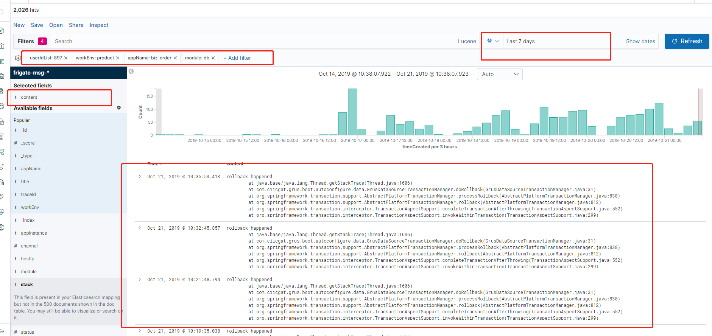

# 收敛 frigate 消息

现在框架埋了很多点，当遇到一些问题的时候，会发送 frigate 消息。这些消息，可能许多都是正常的消息。那么，我们应该如何操作，降低这些频繁无用的消息量，同时使 frigate 报警更加精准呢？

本文叫大家如何操作。

## 通过 ES 分析消息

大家可以通过 frigate 页面右上角的消息点进去。

### 优先处理设计发送消息

增加**realSend:true**和**workEnv:product**的过滤条件（realSend 表示实际发送过）

### 优先处理 top5

把时间拉到最近 7 天，然后点击左下角的 appName，查看 top5 的应用：

### 选择一个 top5 应用

本示例中，我们选取消息量最高的 biz-order。也就是，增加一个 appName:biz-order 的过滤条件。

### 通过 module、content、stack 字段做判断

我们点击 module：

会发现，biz-order 这个应用，大部分是 db 这个模块的问题导致发送出消息的。

所以，我们再增加 module:db 的过滤条件，发现 content 基本都是以下：

所以，我们找出了 biz-order 发送消息的主要原因就是 db 模块的`rollback happened`

## 解决应用的频繁报警消息

1. 优先分析代码，看逻辑可不可以改进。
2. 如果解决不了，且确认这类消息基本为不重要的消息，可以通过[frigate 屏蔽消息方法](https://java.guide.wuxingdev.cn/grus/grus-frigate-message.html#%E5%B1%8F%E8%94%BD%E6%B6%88%E6%81%AF)，把它屏蔽了。

这样子，我们认为 biz-order 这个应用消息泛滥的原因就找到且解决了。
