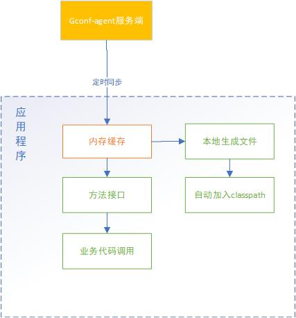

# Gconf 

## 简述

- 对于`application.properties`配置文件，你可以把某条`item`放到 gconf 的某个 properties 文件中，这是能够正常加载。**这条特性最重要**
- gconf 不会在系统启动时，把配置文件下载到本地，然后动态加入到 classpath 中。主要是为了信息安全。所以：`@PropertySource("classpath:redis.properties")`这种写法，在框架里会报错。
- gconf 会在 SpringBoot 启动的时候，把所有的 properties 属性，注入到 ApplicationContext 的 Environment 中。所以，`@Value`依然可以使用。
- 规范上，大家以后统一使用`GConfBean`注解
- ConfigCollection.getBean 方法原先会返回一个动态代理的对象。此实现在自动刷新时，没法更新对象里的值。在字段直接为 public 类型且直接引用的情况下，无法做到自动更新。新版本，会返回一个被 gconf 托管的 bean。在配置变更时，gconf 会更新对象里的属性。如果你不需要一个托管的对象，那么可以使用 ConfigCollection.getLatestBean 方法。

## 服务架构

[服务架构见这里](https://architect.guide.wuxingdev.cn/middleware/gconf.html)

## 客户端架构



说明：

- 对于配置数据，client 中有一份内存缓存。业务代码获取配置数据时，全部是从缓存中取的。所以不要当心客户端的性能。
- 有一个异步的线程，定时从`gconf-agent`中获取最新的数据，再和本地缓存中的数据比较，有更新，则替换。同步周期为两分钟。
- gconf 的配置自动更新能力，就来自于定时同步。我们对 api 进行了增强，大家可以采用多种方式使用 gconf 自动更新的能力。
- 数据除了在内存中有一份，还会写入到本地的文件系统里。key 为文件名，value 为文件内容。同时，**自动把该文件加入 classpath 之中**。之所以这么做的原因在于：许多开源框架通过 classpath 读取配置文件(使用 getResourceAsStream 方法)，这些框架又不可能和 gconf 做集成，提供这种方式，大大增加了 gconf 的适用性和兼容性。
- 客户端启动时，会读取`WORK_ENV`和`WORK_IDC`两个环境变量的值，来判断当前在哪个 idc、哪个环境，才会知道当前的 gconf 域名是什么。这两个环境变量，一般由 Frigate 发布系统 export 的。如果都为空，默认则为开发环境。

## maven 依赖

```xml
<dependency>
  <groupId>com.ciicgat.sdk.gconf</groupId>
  <artifactId>gconf-java-client</artifactId>
  <version>1.0.0</version>
</dependency>
```

## java 原生 API 特性说明和示例代码

- 根据 configAppId 获取配置集合

```java
ConfigCollectionFactory configCollectionFactory = RemoteConfigCollectionFactoryBuilder.getInstance();
ConfigCollection configCollection = configCollectionFactory.getConfigCollection("userdoor");
```

- `ConfigCollection.getConfig(String key)`

  getConfig 返回缓存中，key 对应的 value 值，是原始的字符串。

```java
String redisConfig = configCollection.getConfig("redis.properties");
String jdbcConfig = configCollection.getConfig("jdbc.properties");
```

- `ConfigCollection.getProperties(String key)`

  getProperties 返回缓存中，key 对应的 value 转化为 Properties 的对象。**必须保证 key 的后缀是`.properties`,同时 value 的格式也是`Properties`形式。**

```java
Properties redisProperties = configCollection.getProperties("redis.properties");
```

- `ConfigCollection.getJSONObject(String key)`

  getJSONObject 返回缓存中，key 对应的 value 转化为 JSONObject 的对象。**必须 value 的格式是`JSON`形式。**

```java
Properties redisProperties = configCollection.getProperties("redis.properties");
```

- `ConfigCollection.getBean(String key, Class<T> clazz)`

  getBean 返回缓存中，key 对应的 value 转化为一个 clazz 的 Bean 对象。

```java
SessionProp bean = configCollection.getBean("sessionProp.properties", SessionProp.class);
```

**需要注意几下几点**：

    1. clazz可以是接口或者类。
    2. 当为接口时，返回一个动态代理的对象。该对象所有get方法返回的值，是内存中最新值。你可以认为这个对象是动态刷新的。这是**gconf动态刷新实现的方式之一**。
    3. 当为类时，如果当前运行时支持`Spring cglib`，那么也会返回一个动态代理的对象。特性和为接口时一致。
    4. value的格式，只支持`Properties`和`JSON`两个格式
    5. 当`Properties`或`JSON`某条记录转化为Bean的某个字段时，默认支持驼峰、下划线和大小自动转换。也可以使用`@BeanFieldKey`注解辅助转化。

- `ConfigCollection.getBean(String key, BeanLoader<T> beanLoader)`

  当 value 值，不为`Properties`和`JSON`两个格式时，可以使用此方法：

```java
Set<String> result = configCollection.getBean("ips", new BeanLoader<Set<String>>() {
            @Override
            public Set<String> load(String content) {
                try {
                    return new HashSet<>(IOUtils.readLines(new StringReader(content)));
                } catch (IOException e) {
                    e.printStackTrace();
                }
                return new HashSet<>();
            }
        });
可以看出这个例子里，value为换行的文本，需要把value转化为Set。

注意：同样的value，BeanLoader的load方法只会执行一次。只有value变化时，才会继续执行。
每次调用此方法，返回的是一个缓存对象。

```

## 框架支持

除了原生的 API，我们提供了多种扩展方式支持 Spring 和 servlet 应用程序

### 首推方式：注解@GConfBean

此种方式**支持动态刷新**

```java

import com.ciicgat.sdk.gconf.annotation.BeanFieldKey;
import com.ciicgat.sdk.gconf.annotation.GConfBean;

@GConfBean(appId = "session", key = "redis.properties")
public class RedisPropClazz  {

    @BeanFieldKey(value = "host")
    String myHost;

    @BeanFieldKey(value = "port")
    int myPort;

    @BeanFieldKey(value = "ok")
    boolean ok;

    public String getMyHost() {
        return myHost;
    }

    public Integer getMyPort() {
        return myPort;
    }

    public boolean isOk() {
        return ok;
    }


    public Integer getNotBean() {
        return 1;
    }
}

// 使用时，就像正常的spring bean一样注入：


public class PersonService {
 @Autowired
    private RedisPropClazz redisPropClazz;

  //....
}

```

这种方式，是最简洁的方式。每次调用 getMyHost 都是最新值。

### SpringBoot

**不支持动态刷新**。

```
 new SpringApplicationBuilder(InvoiceApplication.class)
       .initializers(new GConfContextInitializer("xxxxAppId"))
       .run(args);
```

**需要注意**：

不要把`application.properties`文件放到 gconf 里。同时业务配置信息不要放到`application.properties`里，`application.properties`里只放置 SpringBoot 本身的一些配置信息，与环境无关。

## 自动刷新总结

gconf client 提供的自动刷新，依赖于程序使用时，每次都去调用。如果应用程序只是初始化的时候用到某些配置，或者每次读取配置时，都通过单个字段的引用，那么都是不支持的。

支持自动刷新的几种方式：

- 注解@GConfBean

  - 支持

- 每次都通过调用 ConfigCollection.getXX 方法获取配置

  ```
  System.out.println(configCollection.getBean("redis.properties", RedisConfig.class).getHost())

  每次输出最新的host值
  ```

  - 支持

- 维持一个`ConfigCollection.getBean(String key, Class<T> clazz)`返回值的引用

  ```
  private RedisConfig redisConfig = configCollection.getBean("redis.properties", RedisConfig.class)

  public void printHost(){
      System.out.println(redisConfig.getHost())
  }
  在RedisConfig为接口，或者当前运行时有`Spring cglib`支持时，每次输出最新的host值
  ```

  - 某些场景支持：clazz 为接口，或者当前运行时有`Spring cglib`支持时

- 其他方式：

  - 不支持

## 注册变更监听事件

可以通过`ConfigCollection.addConfigChangeListener`注册某个 key 的监听事件。这个可以让开发者自己控制配置变更，自己决定是否更新配置。对变更拥有最大的控制力度。

ConfigChangeListener 代码如下：

```java
public interface ConfigChangeListener {


    /**
     * 该方法会在gconf后台同步数据线程里执行，请保证该方法不要有阻塞。不然会影响gconf更新。
     *
     * @param key      键
     * @param oldValue 老的值,新增key时，该值为null
     * @param newValue 新的值,删除key时，该值为null
     */
    void valueChanged(String key, String oldValue, String newValue);
}
```

示例代码：

```java
configCollection.addConfigChangeListener("ratio.properties", (key, oldValue, newValue) -> {
            Properties properties = PropertiesUtils.readFromText(newValue);
            Map<String, Integer> configs = new HashMap<>();
            for (Map.Entry<Object, Object> entry : properties.entrySet()) {
                configs.put(entry.getKey().toString(), Integer.parseInt(entry.getValue().toString()));
            }

            for (Map.Entry<String, Integer> entry : configs.entrySet()) {
                defaultNotifyAgent.setNotifyAgentRatio(entry.getKey(), entry.getValue());
            }
        });
```
