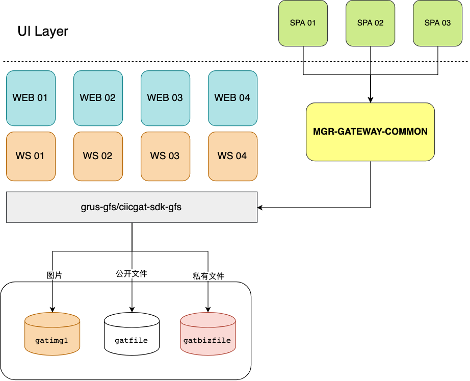

# gfs-client 使用说明

## Motivation

分布式环境下文件上传处理属于无状态请求，多个应用副本需处理某个固定的业务文件。

1. 统一 Java 应用文件存储规范
2. 基于 OSS 完成存储（目前功能，后续将继续拓展）

## 工作机制

> OSS 中定义 3 个 `bucket` 存储当前业务应用中的临时文件和业务归档文件。
>
> | bucket     | access domain                  | 权限 |
> | ---------- | ------------------------------ | ---- |
> | gatimg1    | http://img1.guanaitong.com/    | 公开 |
> | gatfile    | http://file.guanaitong.com/    | 公开 |
> | gatbizfile | http://bizfile.guanaitong.com/ | 私有 |
>
> 单列出`gatimg1`，用于个性化配置 CDN 策略



综述：

- 传统 HTML 基于表单提交数据到后端标准 **Java** 应用
- 标准 **Java** 应用（WS/WEB 均可）使用 `GfsClient`完成文件上传
- 标准 **VUE** 单页应用基于上传组件借助`MGR-GATEWAY-COMMON`

## 使用场景

### 普通文件

1. 用户头像
2. 商品图片
3. 企业 Logo 及资源素材
4. 企业站公开资源

#### 高频无隐私图片类

建议直接使用如下代码：

```JAVA
/**
* 直接上传图片(推荐头像和商品公开图片场景使用)
*
* @param data             图片名称
* @param originalFileName 图片文件名
* @return 图片访问链接
*/
public String uploadImg(byte[] data, String originalFileName) {
  return uploadImgDirectly(data, originalFileName, null);
}

//Client 代码
String imgAccessUrl = gfsClient.uploadImg(sampleData, file.getName());
```

#### 高频无隐私文件素材

```java
// 此时返回的URL 可直接下载改文件
String accessUrl = gfsClient.uploadPublicFile(file.getBytes(), originalFilename);
```

**gatimg1 **和 **gatfile** bucket 因历史遗留原因较为混乱。执行高可用多云存储策略

### 文件导入导出

> TO B 业务管理线中需要导出各种文件。此类场景中导出的文件具有敏感度高，临时性存储的特点

1. 导出员工列表
2. 导出账单明细
3. 导入积分发放
4. 导入部门员工关系
5. 导入纳税人归属关系

规范：

1. **私有 bucket 存储**，不传递 osskey，只传递文件原始名称（包含文件后缀）
2. 此类存储无需报备

原则：临时性高敏感文件系统执行**隔周回收策略**

PS：后续 Client 代码中将不再提供删除方法

```java
/**
* 上传私有文件(适用于导入导出临时文件场景，此文件会定期清理)
*
* @param data             私有文件字节流
* @param originalFileName 原始文件名
* @return 返回私有文件访问URL（需再次请求获取最终访问URL）
*/
public String uploadPrivateFile(byte[] data, String originalFileName) {
  return uploadPrivateFile(data,
                           defaultOssFileKey(data, originalFileName),
                           originalFileName,
                           true,
                           null);
}

// Client 代码：
String privateFileAccessUrl = gfsClient.uploadPrivateFile(sampleData, "signature.png");
// 私有文件返回的URL 需要执行getDownloadUrl4PrivateFile 才能下载
LOGGER.info("文件访问地址：{}", gfsClient.getDownloadUrl4PrivateFile(privateFileAccessUrl));
```

### 文件归档

1. 电子合同
2. 电子发票
3. 电子账单
4. 身份证
5. 营业执照

规范：

1.  **私有 bucket 存储**，需传递 osskey，并传递文件原始名
2.  **此类存储需报备**

原则：永久性高敏感文件系统执行**跨年归档策略**

```java
/**
* 基于字节流, 文件对象Key，下载文件名上传私有文件。
*
* @param data             原文件字节数组
* @param ossFileKey       文件key
* @param originalFileName 原始文件名（用于下载）
* @return 返回私有文件访问URL（需再次请求获取最终访问URL）
*/
public String uploadPrivateFile(byte[] data, String ossFileKey, String originalFileName) {
	return uploadPrivateFile(data, ossFileKey, originalFileName, null);
}


// Client 代码（显式指定文件存储key 如电子发票）
// String ossKey = "einvoice/" + env + "/" + enterpriseId + "/" + fileName;
String fileName = invoiceId + ".zip";
String ossKey = "einvoice/" + env + "/" + enterpriseId + "/" + fileName;
gfsClient.uploadPrivateFile(byteArrayOutputStream.toByteArray(), ossKey, fileName);
```

## 使用说明

> 前提：升级到 `grus` 框架

### Usage

Step 1：引入依赖 grus-boot-starter-gfs, grus 框架体系下，不推荐指定版本。

```XML
<dependency>
    <groupId>com.ciicgat.grus.boot</groupId>
    <artifactId>grus-boot-starter-gfs</artifactId>
</dependency>
```

Step 2 : 基于构造函数注入 `GfsClient`

```java
private final GfsClient gfsClient;

@Autowired
public XxxService(GfsClient gfsClient) {
  this.gfsClient = gfsClient;
}
```

Step 3：上传公共文件返回访问 URL（Controller 层处理样例）

```java
@PostMapping("/uppub")
public ApiResponse<UploadResponse> uploadToPublic(MultipartFile file) {
    UploadResponse response = new UploadResponse();

    String originalFilename = file.getOriginalFilename();

    try {
        String accessUrl = gfsClient.uploadPublicFile(file.getBytes(), originalFilename);
        response.setSuccess(true);
        response.setOriginFileName(originalFilename);
        response.setUploadUrl(accessUrl);
    } catch (IOException e) {
        throw new BusinessRuntimeException(-1, "文件上传失败");
    }

    return ApiResponse.success(response);
}
```

一个简单的文件上传样例就 OK 了。

## 最佳实践

### 基于规则产生 ossFileKey

默认规则：**grus-gfs/${env}/${app_name}/by-days/yyyy-MM-dd/md5(data).Suffix**

```java
/**
 * 确定OSS对象最终存储的文件对象key
 *
 * @param data             文件字节流
 * @param originalFileName 原始文件名
 * @return 生成后的文件名
 */
private String defaultOssFileKey(byte[] data, String originalFileName) {
    StringBuffer gfsDefaultBuffer = new StringBuffer("grus-gfs");
    gfsDefaultBuffer.append("/").append(Systems.WORK_ENV);
    gfsDefaultBuffer.append("/").append(Systems.APP_NAME);
    gfsDefaultBuffer.append("/").append("by-days"); // 默认存储逻辑为：按日期切分
    gfsDefaultBuffer.append("/").append(LocalDateTime.now().format(DATE_TIME_FORMATTER));
    gfsDefaultBuffer.append("/").append(DigestUtils.md5Hex(data));
    gfsDefaultBuffer.append(getSuffix(originalFileName));
    return gfsDefaultBuffer.toString();
}
```

针对归档类文件存储，必须自定义符合规则的 OssKey（代码静态扫描发现未报备 KEY 将终止上传）。

@atschx 于 2019 年 07 月 16 日
