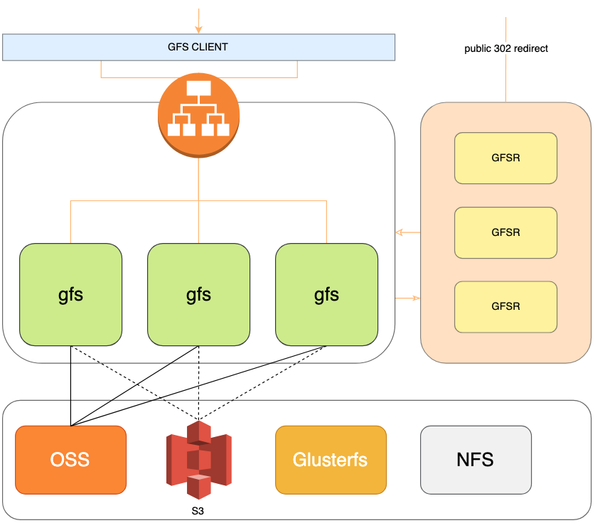
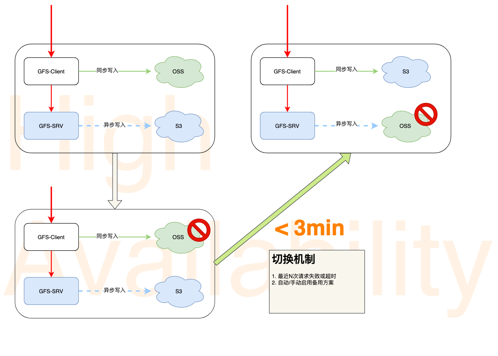

# 分布式存储

关爱通文件服务（gfs），基于公有云存储服务搭建。

## 设计目标

- 统一 Java 应用文件存储规范（不增加当前运维成本，规范化文件上传及提取流程）
- 文件存储服务高可用（不单点依赖任何一家云存储服务，隔离底层存储设施）
- 文件可追溯（减少文件碎片）

## 方案设计

底层存储：**OSS、S3**、Glusterfs（后期）

中间服务：文件二级映射、多云集成、多云切换

接入服务：gfs client、gfsr（公共文件多云切换 redirect）

### 故障切换

阶段一：OSS 主，S3 备

此阶段为 GFS 健康终态，所有文件的读写都由 OSS 提供。GFS 后台常驻线程进行文件多云传递及临时文件清理工作。

阶段二：OSS 宕，S3 备

此阶段为故障判定阶段，一期设计为手动切换。

阶段三：S3 主，OSS 待

此阶段为服务可用态，所有文件读写经 S3 提供。OSS 等待恢复

## 文件服务

各应用对文件服务的核心诉求为：上传和下载。由 gfs-client 对外提供 client 端工具方法。

针对浏览器及 APP 中使用到的后端上传管理的文件采用 GFSR 直接 302 的模式提供，解决故障时的切换问题。
