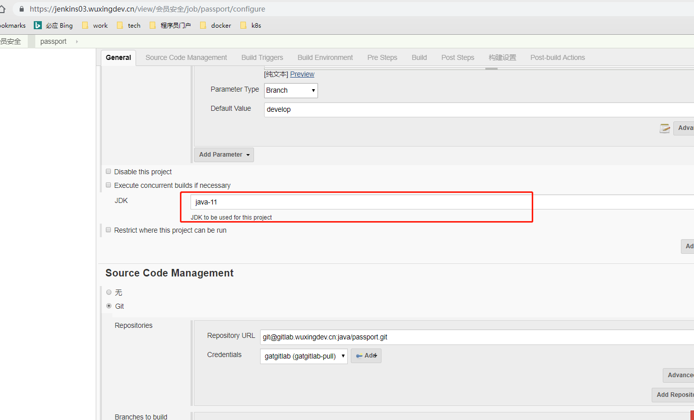
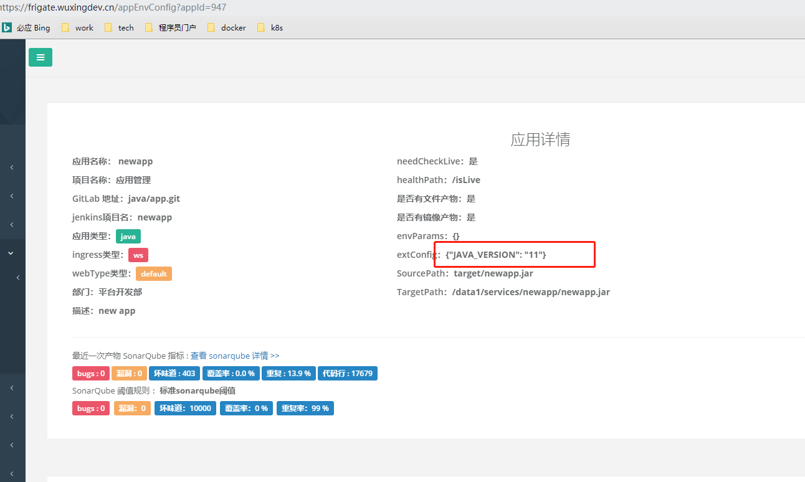

# Grus 项目结构

## 环境和依赖说明

- jdk11：[openjdk11 下载地址](https://jdk.java.net/archive/) 
- maven：建议使用 3.6+版本。

> 可参考 [java安装](../../prepare/develop-env/java-install.md) 和 [maven安装](../../prepare/develop-env/maven-install.md)

## 项目 POM

### parent

maven pom parent 需要继承`grus-boot-starter-parent`，如下：

```xml
<parent>
    <groupId>com.ciicgat.grus.boot</groupId>
    <artifactId>grus-boot-starter-parent</artifactId>
    <version>${suggested-version}</version>
</parent>
```

**需要重点注意**：此 parent，包含了 SpringBoot、Grus、Grus Boot、常用第三方、巨灵神 API（`2021.1`及以前的版本） 等的所有依赖。所以大家，无须再 import 这些框架的 BOM。

自`2021.2`开始，框架和巨灵神的引用不再放在一起，即使用`2021.2`及后面的版本，需要在父POM添加如下：

```xml
    <dependencyManagement>
        <dependencies>
            <dependency>
                <groupId>com.ciicgat.api</groupId>
                <artifactId>ciicgat-agg</artifactId>
                <version>2.0-SNAPSHOT</version>
                <type>pom</type>
                <scope>import</scope>
            </dependency>
        </dependencies>
    </dependencyManagement>

```

### build 插件

```xml
 <build>
    <finalName>${project.artifactId}</finalName>
    <plugins>
      <plugin>
        <groupId>org.apache.maven.plugins</groupId>
        <artifactId>maven-compiler-plugin</artifactId>
      </plugin>
      <plugin>
        <groupId>org.jacoco</groupId>
        <artifactId>jacoco-maven-plugin</artifactId>
      </plugin>
      <plugin>
        <groupId>org.springframework.boot</groupId>
        <artifactId>spring-boot-maven-plugin</artifactId>
        <executions>
          <execution>
            <goals>
              <goal>repackage</goal>
              <goal>build-info</goal>
            </goals>
          </execution>
        </executions>
      </plugin>
    </plugins>
</build>
```

## 使用规范

1. pom 中，**只允许通过 starter 引入 grus 和 spring 依赖**。
2. 必须在 application.propertes(或者 yaml)里设置`spring.application.name`的值。该值必须为 frigate 里的应用名。应用部署到统一环境之后，在启动的时候，会校验该值是否和系统环境变量中的 APP_NAME 一致。不一致会启动出错。
3. 不允许使用原来`ciicgat-sdk`和`ciicgat-boot`两个老框架

## 部署

Grus 框架只支持 jar 包方式部署在 docker 容器中。所以对于老的应用，假如生产部署在 k8s 中，那么要使用 grus 后，要迁移到 k8s 里。

同时，在上线时，需要和运维说明，项目使用 java11.

运维会把 Jenkins 中项目的 jdk 配置为 java11，如下图：



同时，frigate 应用属性中，也会有 java11 的配置：



## 示例项目

web 层的，大家可以查看[passport](https://gitlab.wuxingdev.cn/biz/member/passport)

服务层的，大家可以查看[newapp](https://gitlab.wuxingdev.cn/biz/member/newapp)
