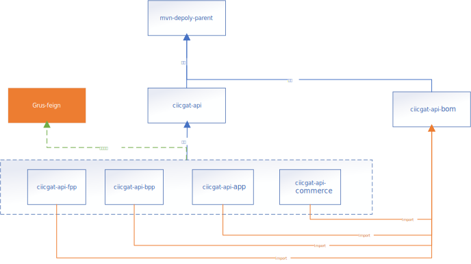

# feign

## 使用说明

- 依赖引入

  ```xml
  <!-- 对于开发来说，一般不需要引入这个模块 -->
  <dependency>
      <artifactId>grus-feign</artifactId>
      <groupId>com.ciicgat.grus</groupId>
  </dependency>
  ```

- 大家在创建 feign-service 的时候，支持以下写法

  ```java
  @Service
  public class AppService{ 
    @FeignService
    private PersonService personService;

    @FeignService(cacheBinding = @CacheBinding(method = "getPersonById", params = {0}))
    private PersonService personService2;
  }
  
  // 下面这种写法不再推荐：
  @Configuration
  public class DependencyServiceConfig {
    @Bean
    public PersonService personService() { 
      return FeignServiceFactory.newInstance(PersonService.class);
    }
  }
  ```

* 巨灵神 api 中，对于可能为 Null 的返回，推荐大家使用 Optional
* 新增了`com.ciicgat.grus.service.naming.NamingService`模块，大家可以使用它，从一个 serviceName 获得相关的服务地址。
* 新增了`FeignServiceBuilder`来创建对象

## 日志打印

- 新增了打印 feign 日志的配置：

```properties
grus.feign.log-req=true  //打印feign请求日志
grus.feign.log-resp=true  //打印feign返回日志
```

对于有特殊的有敏感信息的接口可以使用@LogExclude 取消接口的日志打印。

```java
public interface AppApi{ 
    @RequestLine("POST /getPassword") 
    @LogExclude 
    String getPassword(@Param("memberId") Integer memberId);   
}
```

如果接口的出参或入参超长，目前是超过 2000 字符，超出部分将会被截断，不会被打印。

## 业务api-sdk

### 项目结构



### 说明

如上图：

1. `grus-feigh`模块，是所有 api 的实现基础。
2. 会员中心 ciicgat-agg-member
3. 资产中心 ciicgat-agg-asset
4. 支付中心 ciicgat-agg-payment
5. 结算中心 ciicgat-agg-settlement
6. 应用产品中心 ciicgat-agg-newapp
7. 基础服务 ciicgat-agg-base

### API 框架特点

封装了服务调用规范

1. 所有请求增加了`SITE-ID`、`APP-ID`、`REQUEST-ID`。可用于服务请求的统计、监控、调用链追踪。
2. 请求支持原有`URLFORM`格式和`REST`风格
3. 在`okhttp`和`feign`的基础上做扩展，方便以后切换到`spring cloud feign`+`spring cloud hystrix`
4. 反序列化支持 JAVA 的新规范和 PHP 老应用规范。
5. Endpoint 统一配置，开箱即用，应用中无需再配置服务地址。
6. 返回 code 初步统一，全局唯一。可使用枚举恒等比较`ErrorCode`。

### 使用规范

具体项目中，以如下使用方式，无需加上版本：

```xml
<dependencies>
  <dependency>
    <groupId>com.ciicgat.api</groupId>
    <artifactId>ciicgat-api-captcha</artifactId>
  </dependency>
  <!-- userdoor -->
  <dependency>
    <groupId>com.ciicgat.api</groupId>
    <artifactId>ciicgat-api-userdoor</artifactId>
  </dependency>
  <!-- passport -->
  <dependency>
    <groupId>com.ciicgat.api</groupId>
    <artifactId>ciicgat-api-passport</artifactId>
  </dependency>
  <dependency>
    <groupId>com.ciicgat.api</groupId>
    <artifactId>ciicgat-api-giveapp</artifactId>
  </dependency>
</dependencies>
```
