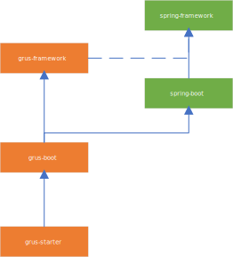
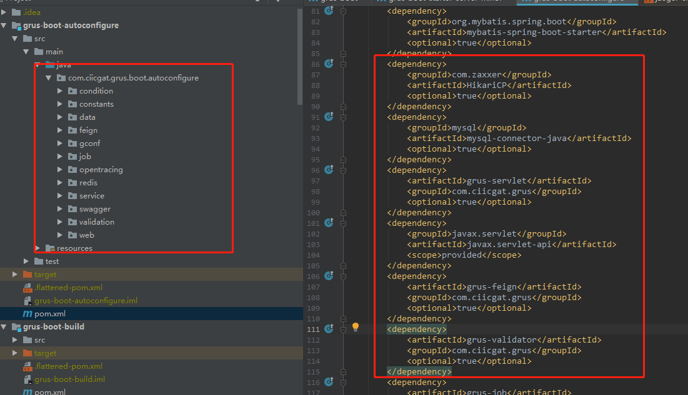
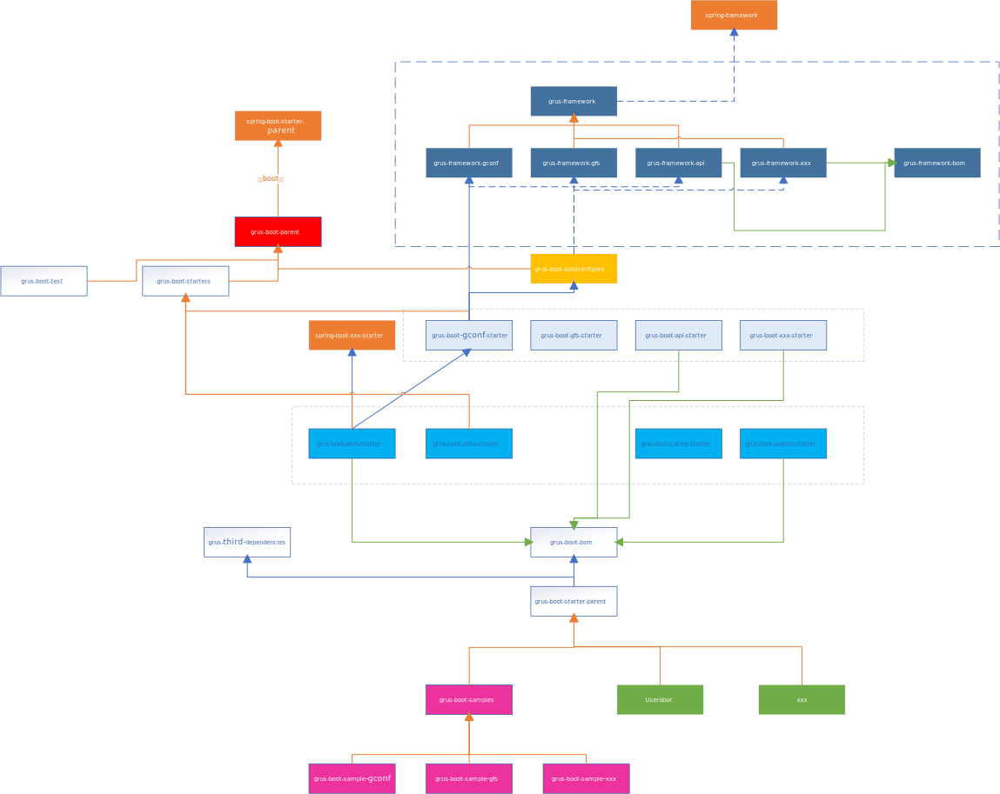

# Grus 设计思想

Grus 框架是关爱通 Java 团队继巨灵神框架之后，第二次重大的架构升级。虽然巨灵神框架的许多设计和理念很先进，但是技术在前进。在当前阶段下，其有一些缺陷不满足我们技术发展的需求。

感谢`@孙长浩`贡献 Grus 这个名字。

## Grus 整体设计思想

### 面向 Java11

1. java11 有许多新特性和 jvm 性能的提升，许多都是我们期望在实际工作中使用的，比如 G1 垃圾回收。
2. 整个架构团队希望 Grus 框架能够支持 Java11，这需要 grus 本身和依赖框架同时都可以。

### 全面拥抱 SpringBoot

1. 所有的项目全面基于`SpringBoot`框架。统一使用 jar 部署。不管 web 还是 service；
2. 在`SpringFramework`之上，扩展和封装一层`grus-framework`；
3. 在`SpringBoot`之上，扩展和封装一层`grus-boot`；
4. 用户在使用的时候，只需要直接引入`grus-starter`即可；
5. 学习`spring boot`的做法，在 autoconfigure 项目集中编译、执行单元测试，保证 jar 包版本没有依赖问题。
   
   
   

### 详细结构

看图前说明：

- 图片有点大，可以在新的浏览器标签页打开更清楚
- 橙色的线条，表示 parent 关系。比如`spring-boot-parent`是`gurs-boot-parent`的 parent
- 蓝色的实线线条，表示强依赖关系。
- 蓝色的虚线线条，表示可选依赖关系。
- 同颜色的长方形，表示属于相同的模块

#### grus-framework

1. `grus-framework`是基础架构能力的底层体现，它基于`spring-framework`
2. `grus-framework`里有很多模块，包括 gconf、gfs 等等，这些原来 ciicgat-sdk 里的会平滑迁移过来
3. `grus-framework`的对外由`grus-framework-bom`输出

#### grus-boot-parent

1. 它以`spring-boot-parent`为父依赖，通过其定义了使用的 SpringBoot 里所有组件的版本

#### grus-boot-autoconfigure

1. 这个模块是`grus-boot`的**最核心**模块
2. 它可选择的依赖所有的`grus-framework`,形成一个收紧的壶。通过它，可以确保框架模块之间没有依赖冲突和隐藏的版本不兼容。
3. 所有的`grus-framework`的自动配置功能，都是由此模块实现。

#### grus-boot-starters

1. 此模块定义了用户使用的所有 starter。
2. 此模块都是基于`grus-boot-autoconfigure`，另外，每个模块只包含一个 pom 文件，定义了此模块的实际 jar 依赖。(因为`grus-boot-autoconfigure`对实际 jar 的是可选依赖，不会传递下去)
3. starters 主要有两层：第一层为`grus-framework`的 starter，第二层为基于第一层和`spring-boot-starter`的封装层。第二层也是最终面向用户的一层。

#### grus-boot-starter-parent

1. 它主要继承自`grus-boot-bom`，这个定义了 spring、grus 的所有组件
2. 同时还继承自`grus-third-dependencies`，这个定义了常用的一些三方包，比如解析 excel 的 poi
3. 此模块为所有项目的 parent

#### grus-boot-samples

1. 此模块为示例项目，是脚手架。maven archetype 基于此模块。

## 编译 Grus 项目要求

- 需要安装 jdk11
- 需要安装 maven3.6+版本
