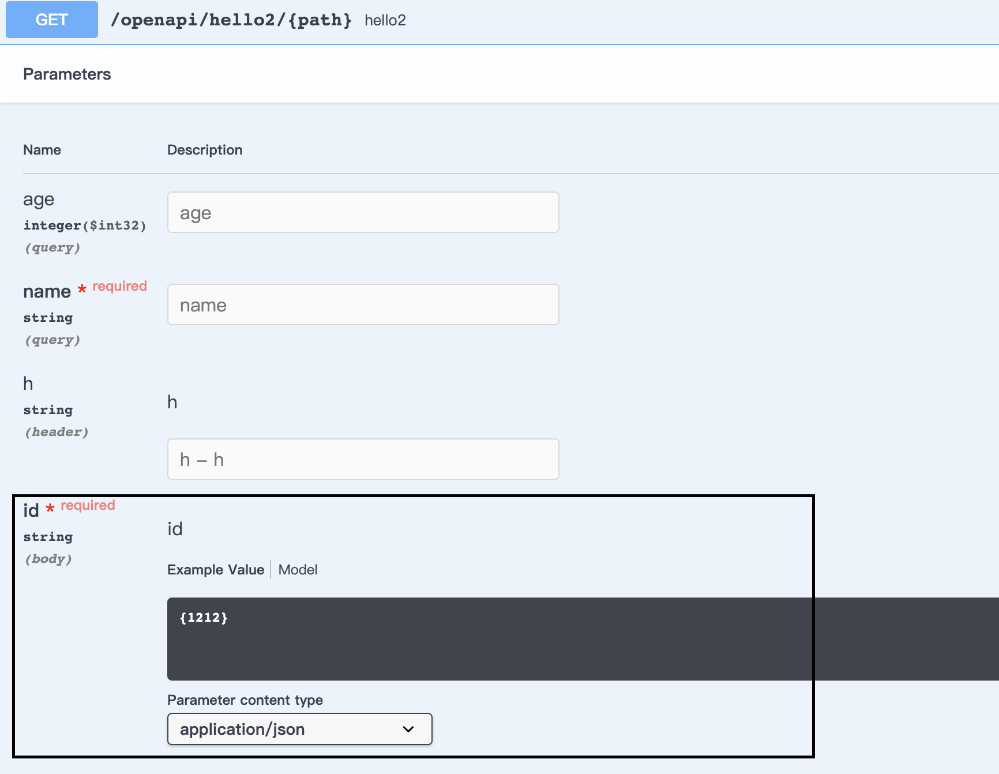
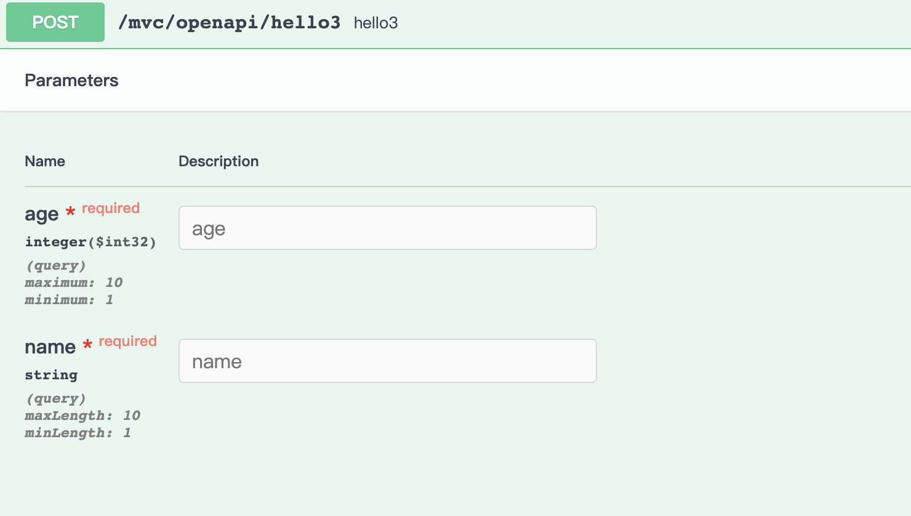

# swagger 使用说明

我们目前使用 springfox-swagger 来生成文档展示，并为公司的自动化测试提供了接口标准与说明，所以写法一定要规范。

## 特别注意事项：

针对 `form` 或者 `query` 的请求，我们一般会这样写：

```java
@PostMapping("/hello2/{path}")
 @ApiOperation("hello2")
public ApiResponse<String> hello2(@PathVariable("path") String path,
                                   @NotBlank @Size(max = 20) String id) {
        return ApiResponse.success(path);
    }
```

但是这样，**id 在 swagger 页面上的展示会有问题，不符合预期**。如下：



所以针对此类型的参数，一定要加上 `@RequestParam` 或者 `@RequestPart` （看使用场景），即：

```java
  @PostMapping("/hello2/{path}")
  @ApiOperation("hello2")
 public ApiResponse<String> hello2(@PathVariable("path") String path,
                                   @RequestParam @NotBlank @Size(max = 20) String id) {
         return ApiResponse.success(path);
     }
```

> 如果 id 什么注解都不加，也会正常展示，但一般情况下，我们都需要对参数进行一些校验，所以仍强烈推荐加 `@RequestParam` 注解。前面提到的展示不符合预期，是 swagger 解析注解的问题，此处不进行详细讨论。

## 启用

swagger 开发/测试默认开启 swagger，生产/预发关闭。

通过 `grus.swagger.enabled=true/false` 控制。

## 入口地址

grus 版本小于 `2021.1.1`：

`http(s)://{host}/{context-path}/swagger-ui.html`

grus 版本从 `2021.1.1` 开始，入口地址变更为：

`http(s)://{host}/{context-path}/swagger-ui/`。

`context-path` 由 `application.properties` 文件中的 `server.servlet.context-path={context-path}` 决定。如果没设置，入口地址则为：`http(s)://{host}/swagger-ui.html` 或 `http(s)://{host}/swagger-ui/`

### web

针对 ws 服务，我们都用 host 来区分服务，所以一般不需要设置 context-path，直接 `http(s)://{host}/swagger-ui/` 即可访问。

但是针对 web 服务，我们一般用一级 path 来区分服务，部署到开发/测试环境后，直接 `http(s)://{host}/swagger-ui/` 是访问不到的，所以我们若要使用，一定得配置 `context-path`。

同时 web 服务大多会有拦截器，在拦截器中需要去除 swagger 相关路径的拦截（也可以不去除，要求一定要登录了才能访问）。要排除的地址大致如下：

`2021.1.1` 前：

```
/swagger-ui.html
/webjars/springfox-swagger-ui/**
/swagger-resources/**
/v2/api-docs
```

`2021.1.1` 后：

```
/swagger-ui/**
/swagger-resources/**
/v2/api-docs
/v3/api-docs
```

## validator

我们默认引入了 `springfox-bean-validators` 来优化 swagger 的展示，效果如下：

图 1 - 未使用 javax 注解


图 2 - 使用了 javax 注解



当我们使用了 validator 来校验参数时，swagger 会同步展示出来，提高了可读性。

但是该特性支持 javax 的注解比较好，别的扩展注解，展示有可能会有问题，所以相同功能下，尽力使用 javax 的注解替代 hibernate，例如：

- 针对 `String`，使用 `@javax.validation.constraints.Size` 替代 `@org.hibernate.validator.constraints.Length`；
- 针对 `Integer`，使用 `@javax.validation.constraints.Min`，`@javax.validation.constraints.Max` 替代 `@org.hibernate.validator.constraints.Range`（展示有点问题）。

目前支持的注解如下：

```
@DecimalMin/@DecimalMax
@Min/@Max
@NotBlank
@NotNull
@Pattern
@Size
...（别的扩展注解，但是展示有可能有问题）
```

```

```
