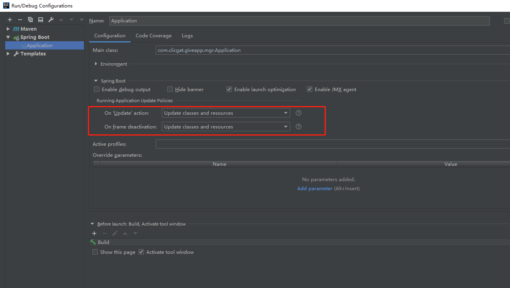

# web 模块

- 框架默认提供了`GlobalExceptionHandler`。开发无需再写 ExceptionHandler。

- 可以通过`grus.web.error-code-prefix=1002`，配置 error-code 前缀

- `GlobalExceptionHandler`的优先级最低，如果应用自己已经写了 ExceptionHandler，那么还是会优先使用自己的。

- 项目在迁移的时候，可以把自己写的`XXBusinessRuntimeException`继承`com.ciicgat.sdk.lang.convert.ErrorCode`，然后删除自己的 ExceptionHandler 即可。

  grus 实现原理如下：

  ```
      @ExceptionHandler
      public ApiResponse<Object> handleThrowable(HttpServletRequest request, Throwable throwable) {
          if (throwable instanceof ErrorCode) { //为了应用迁移方便
              LOGGER.warn("errorCode {} errorMsg {}", ((ErrorCode) throwable).getErrorCode(), ((ErrorCode) throwable).getErrorMsg());
              return ApiResponse.fail((ErrorCode) throwable);
          }

          StringBuffer requestInfo = request.getRequestURL();
          request.getParameterMap().forEach((key, value) -> requestInfo.append(key).append(":").append(Arrays.toString(value)));
          String msg = "发生异常,请求信息为：" + requestInfo.toString();
          FrigateNotifier.sendMessageByAppName(msg, throwable);
          LOGGER.error(msg, throwable);
          return ApiResponse.fail(new StandardErrorCode(webProperties.getErrorCodePrefix(), 1, 0, "系统错误:" + throwable.getMessage()));
      }
  ```

- 现在框架会自动帮你填充 swagger 配置。你无需再写配置了。预发和生产环境会关闭 swagger 功能。

- application.propertis 文件里，ciicgat-api.swagger 配置被移除，替换成 grus.swagger

- 对于 web 层的应用，我们一般使用一级 path，推荐大家使用 contextpath:

```
server.servlet.context-path=limit
```

- `com.ciicgat.sdk.servlet.CorsFilter`被删除，请大家使用 Spring 原生的`CorsRegistry`：

```
    @Bean
    public WebMvcConfigurer webConfigurer() {

        return new WebMvcConfigurer() {

            @Override
            public void addCorsMappings(CorsRegistry registry) {
                registry
                        .addMapping("/**")
                        .allowedMethods("POST")
                        .allowedOrigins("*")
                        .allowedHeaders("*");
            }
        };
    }
```

- 许多`server.*` 属性 ( Servlet 特有的) 已经转移到`server.servlet`。比如：`server.context-path`->`server.servlet.context-path`，`server.servlet-path`->`spring.mvc.servlet.path`
- 加入了简单的[流量控制](../limit/index.md)功能。
- 当我们使用模板的时候，如果想改了模板实时看到效果，需要在 idea 里的 main 函数设置里，配置如下参数：



##框架日志

对于 Controller 中的服务接口，框架通过 AOP 提供了统一的日志输出能力。输出格式如下

```
WEB_REQ METHOD:TestController.doTest PARAM:[{"name":"aa","age":18},{"address":"我家"}]
WEB_RESP METHOD:TestController.doTest RESULT:{"code":0,"msg":"OK","data":true}
WEB_EX TestController.doTest
        java.lang.NullPointerException
        at com.ciicgat.TestController.service.(TestService.java:201)
```

可以利用日志关键词更高效的进行日志检索。

Web 日志功能默认是不启用的，想要打开该功能可以在 boot 启动函数上增加@EnableGrusWebLogJob 注解：

```java
@SpringBootApplication
@EnableGrusWebLogJob
public class TestWebApplication {..}
```

日志打印仅针对 Restful 的接口有效，对于 springmvc 项目，视图接口将不会打印对应日志。对于有特殊的有敏感信息的接口可以使用@LogExclude 取消接口的日志打印。

```java
@ResponseBody
@PostMapping("/test")
@LogExclude
public ApiResponse<String> getPassword(String code);
```

如果接口的出参或入参超长，目前是超过 2000 字符，超出部分将会被截断，不会被打印。
