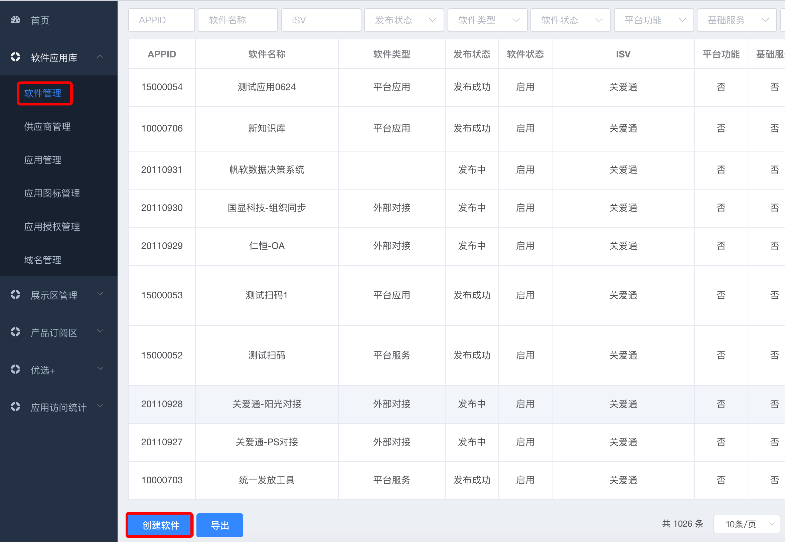
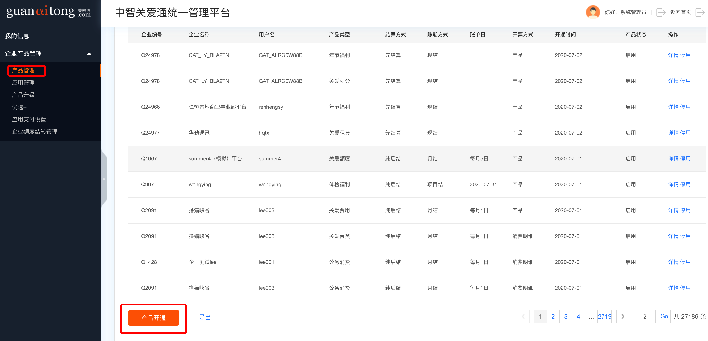
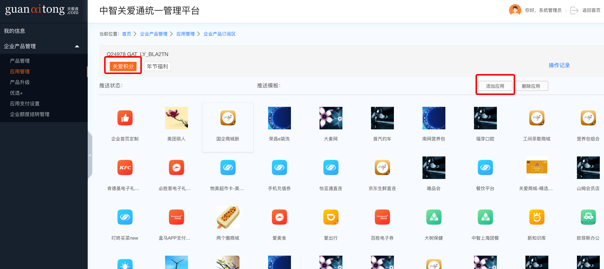
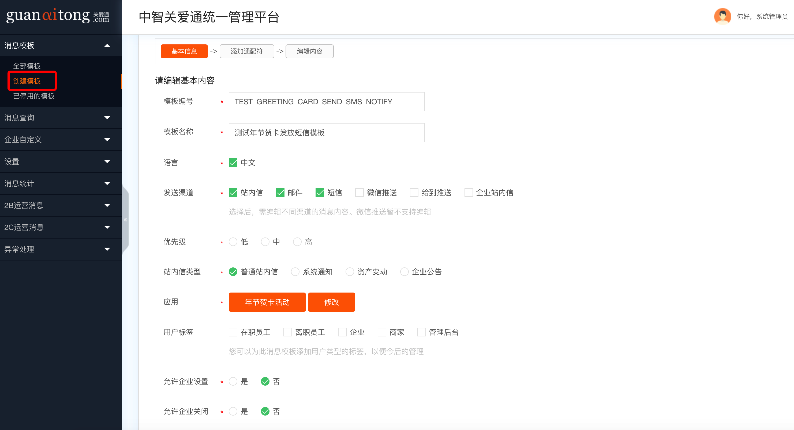
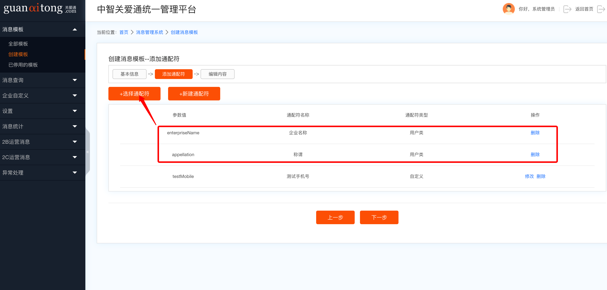
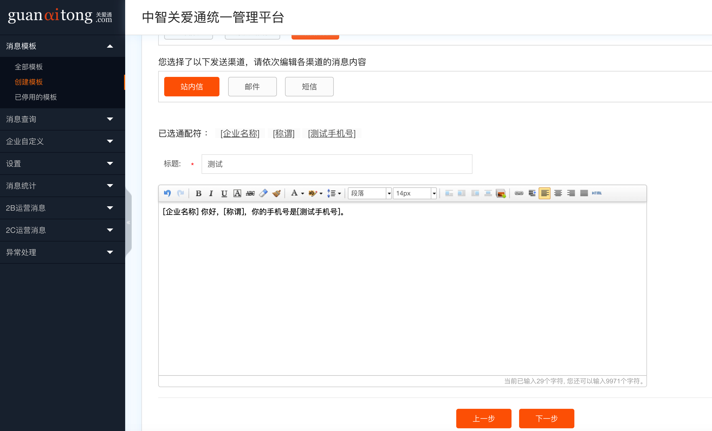

# 应用开发指南

本章简单描述下，开发一个关爱通项目经过的流程。

## 项目结构

我们服务/应用一般分为 web（公网可访问，不允许链接数据库） 和 ws（公网不可访问，可链接数据库），web 通过调用 ws，来访问数据库，或者执行一些逻辑。

我们使用 maven 来管理项目，一个完整的项目，可能包含多个模块（应用），具体见 [Grus-项目结构](https://java.guide.wuxingdev.cn/grus/grus-project-structure.html)。

除此外，应用按照访问对象划分，可以分为：

- 员工用户-web
- 企业管理员-web
- 商家管理员-web
- GAT-MGR 用户
- 底层服务-ws
- 其他，不限制访问用户或者自定义-web

在实际开发一个项目前，得明确该项目会有几个模块（部署几个应用），以下是一个包含多个模块的项目示例：

```
mall
--mall-service（ws，底层服务）
--mall-mobile（web，员工用户访问）
--mall-mgr-bff（ws，mgr 后台需要的服务，由 kong 网关转发，所以是 ws 而不是 web）
--mall-admin（web，企业管理员用户访问）
```

## 准备工作

### 申请应用 APPID

在项目开发前，一般需要申请一个应用的 APPID。由相关产品，联系应用订阅关系的产品负责人**李晓东**申请。

一般是先由产品在生产环境申请好后，再由开发在测试和开发环境配置，并且尽量保持**三个环境一致**，便于后续的管理。

#### 申请入口

登录 **mgr 后台**，访问 **应用管理系统 new**，软件应用库菜单-软件管理，滑倒最下面，创建软件。



一个关爱通应用，目前有 5 种类型，如下，请选择合适的类型：

- 平台应用
- 电子票
- 企业功能
- 职能系统
- 平台服务
- 外部对接


> APPID 在后续使用很多别的系统，如：消息系统、收银台、mgr 权限管理等等时会用到

### 申请 gconf

gconf 是一个统一的配置中心，类似于 Apollo。原理与使用参考：[Grus 框架-gconf](../grus/gconf/index.md)

联系周智伟/乙克川，创建开发应用的关联组与其下的 app。每个 app 对应一个空间，可以添加多个配置（一般每个应用都会与一个 app 对应）。这些配置内容，可通过框架在应用中获取。

> 每个配置是 key-value 格式，key 是配置的名称，value 是配置的实际内容。
>
> 目前支持 properties 和 json 格式，其余需自定义处理。

### 申请数据库

#### 创建数据库

开发环境数据库可以通过任意工具连接，也可以走下面的标准流程，账号信息见 [内部账号](https://guide.wuxingdev.cn/common/public.html)。

测试与生产数据库的创建与修改，需要走 frigate 上的标准流程，在 CI/CD -> 数据库发布 -> 申请列表 中，选择结构变更申请/数据变更申请/建库申请。

#### gconf 配置

创建好数据库后，需要联系运维（姚亮/杨昆）在对应的 gconf 生成 datasource.json 数据库文件，具体见 [Grus 框架-data](../grus/data/index.md)

### 申请 redis

联系运维（姚亮/杨昆）在对应的 gconf 生成 redis-config 文件，具体见 [Grus 框架-redis](../grus/redis/index.md)

### 错误码申请

关爱通应用有一个统一规范的错误码，具体见 [关爱通应用返回 code 说明](https://guide.wuxingdev.cn/common/code.html)

需要为项目申请一个业务错误码前缀，针对这个文件[code.md](https://gitlab.wuxingdev.cn/tech/guide/blob/master/common/code.md)提交 PR。

### 域名规划

项目部署时的域名，一般遵循以下规则（以下示例为生产）：

ws 应用，根据域名区分应用，一般部署为：`http://{site_name}.services.product.sh`

web 服务根据一级 path 区分应用，根据用户端与 MGR 端区分为：

- MGR 端：`https://a.ciicgat.com/{site_name}`
- 用户端：`https://a.guanaitong.com/{site_name}`
- 企业端：`https://admin.guanaitong.com/{site_name}`

> 有些情况会使用域名来区分应用，例如 `https://eap.ciicgat.com`，但 ciicgat 是 MGR，guanaitong 是一般对外访问的规则不变，请根据实际需要申请域名。

## 常用模块

项目结构见 [Grus-项目结构](../grus/introduction/project-structure.md)，这里简单介绍下几个常用的业务模块。

### 会员

关爱通有一套复杂的用户体系，member 是核心，基于 member 衍生了不同的用户（每个用户除了自己的 ID 外，都会包含 memberId），例如：

- Person-员工
- Enterprise-企业
- Seller-商家
- Group-集团
- ......

会员模块集成了所有相关服务，可以获取不同的用户信息，引入 GAV 如下：

```xml
        <dependency>
            <groupId>com.ciicgat.api</groupId>
            <artifactId>ciicgat-api-userdoor</artifactId>
        </dependency>
```

常见的服务为：

- MemberService

- PersonService
- EnterpriseService
- .....

> 该模块是最常用的模块

### 登录认证

引入 GAV 如下：

```xml
        <dependency>
            <groupId>com.ciicgat.api</groupId>
            <artifactId>ciicgat-api-passport</artifactId>
        </dependency>
```

#### 认证

我们一般用 passport 提供的 PassportAuth 来认证用户的登录状态与信息。

```
UserLoginInfo userLoginInfo = PassportAuth.getUserLoginInfo(request, LoginUserType.PERSON);
```

该类根据 request 中的 cookie 来判断是否有指定的登录用户类型在登录中，如果 userLoginInfo 为 null，表示用户未登录。userLoginInfo 存在的话，我们会用对象中的 memberId，获取当前登录用户信息的更多内容进行处理。

#### 登录

```
LoginRedirector.redirect(response, MemberType.PERSON,url);
```

跳到指定类型用户登录页，根据传入的 url，登录后跳转回应用，继续后续的业务。

#### 常用

有登录态时，当前登录用户是最常用到的信息，为了避免在一次请求中重复调用接口获取用户信息，或者将整个对象放到方法的参数中，降低了可读性、增加了传参的风险，我们一般在 interceptor 统一获取用户信息，然后在 request 或 threadLocal 中存储该对象，然后在方法的调用中直接读取即可。

以下是使用 threadLocal 来存储当前登录用户的 demo，在 controller/service 中，通过 `ContextHolder.getCurrentUser()` 获取用户信息。

```java
public class ContextHolder {

    private ContextHolder() {
        // hide constructor
    }

    private static ThreadLocal<User> threadLocal = new ThreadLocal<>();

    public static void setCurrentUser(UserLoginInfo userLoginInfo, PersonService personService) {
        threadLocal.set(fromUserLoginInfo(userLoginInfo, personService));
    }

    public static User getCurrentUser() {
        return threadLocal.get();
    }

    public static void clear() {
        threadLocal.remove();
    }

    private static User fromUserLoginInfo(UserLoginInfo userLoginInfo, PersonService personService) {
				......
        return null;
    }


}
```

interceptor 中存入对象

```java
@Component
public class LoginInterceptor implements HandlerInterceptor {

    @FeignService
    private PersonService personService;

    @Override
    public boolean preHandle(HttpServletRequest request, HttpServletResponse response, Object handler) throws Exception {
        UserLoginInfo userLoginInfo = PassportAuth.getUserLoginInfo(request, LoginUserType.PERSON);
        if (userLoginInfo == null) {
						......
            return false;
        }
        ContextHolder.setCurrentUser(userLoginInfo, personService);
        return true;
    }

    @Override
    public void afterCompletion(HttpServletRequest request, HttpServletResponse response, Object handler, Exception ex) {
        ContextHolder.clear();
    }
}
```

### 应用订阅关系

应用订阅是关爱通应用的核心，针对员工/企业用户，MGR 应用，企业内部系统应用等，具有各种配置，包含但不限于是否有权限访问，支持使用哪些资产等等。

如果需要用到这个模块，需要进行如下操作。

#### 校验是否可访问

开发应用中，最常用的是校验该应用某用户是否可访问。

需引入 GAV：

```xml
        <dependency>
            <groupId>com.ciicgat.api</groupId>
            <artifactId>ciicgat-api-newapp</artifactId>
        </dependency>
```

Code:

```java
    @FeignService
    AppCheckService appCheckService;

    public void checkAppAccess(Integer memberId, String appid) {
            appCheckResult = appCheckService.checkAccess(appid, memberId, null);
    }
```

appId 指某应用，memberId 指访问的用户。如果该用户无权限访问访问，该方法会抛出 BusinessFeignException，开发者拦截后进行相应处理。

> 有时候，员工没有该资产也会被拦截。

#### 软件配置

软件创建完成后（见前面的申请应用），点击继续发布（或者详情），可以进行软件配置。


根据产品需求，设置该应用支持哪些用户使用，与支付时能够使用的资产。

- PC/MOB 地址：员工访问的地址，在 给到/H5/PC 展现的应用的访问地址；
- 企业端地址：企业用户/企业管理员 访问应用的管理界面地址；
- MGR 权限地址：获取应用的所有权限信息，返回一个标准的 json，方便 MGR 统一的权限管理使用；
- MGR 地址：MGR 后台的应用入口地址


应用类型：标准还是定制，看业务需求。

标准的话，后续可以发布到应用市场，由企业自己订阅。定制的话则不可以。

别的参数介绍见应用订阅关系系统的详细说明。

#### 产品订阅区

应用配置完成（即发布完成）后，如果需要给**员工/企业**使用，一般需要将应用放到对应的产品订阅区，不然有可能导致：

- 应用订阅检验失败；
- 无法使用对应的资产，例如：如果你想支持积分支付，一定得将这个应用放到**关爱积分**这个订阅区下。

应用发布订阅区流程如下：


公开类型可选公开、非公开、内测等。

选择公开可以让企业在应用市场订阅应用，否则只能在后台配置。

如上，一个应用的最简单的发布流程就完成了。但是用户（员工/企业）还无法访问该应用或者使用相关资产，得企业订阅了这个应用才行。这就牵扯到了下面的产品目录。

### 产品目录

关爱通的业务根据场景，划分了很多产品线，例如：关爱积分、关爱额度等等。基本所有的平台应用，都要放入某个产品线下。

#### 开通产品线

MGR 后台进入 **产品目录**：

**开通产品线**：




选择好产品后提交，即可给这个企业创建某个产品线。

#### 应用管理

除了在企业端订阅公开的应用外，统一支持在产品目录订阅应用。




在不同的产品线下，添加应用，即可让该企业订阅了该应用，如果支付的话，也能使用对应的资产。

### 消息系统

关爱通有统一的消息系统，用来发送短信、邮件、给到的通知、微信的通知等等，需要引入 GAV

```xml
        <dependency>
            <groupId>com.ciicgat.api</groupId>
            <artifactId>ciicgat-api-notification</artifactId>
        </dependency>
```

大多数接口，入参会有 appId 参数，请尽量设置，便于后期问题的排查与消息的追踪。

消息的查询与设置，在 **MGR 的消息管理**中统一处理。

#### 基础使用

不基于模板，单个发送简单的短信或者邮件时，可使用。

> 一般建议基于模板配置，后期文案可以联系产品修改，避免项目再次发版。

```java
@Slf4j
@Controller
public class MessageController {

    @FeignService
    SmsSendService smsSendService;

    @FeignService
    EmailSendService emailSendService;

    @RequestMapping(value = "/message/emaysoftcom/sendSMS")
    public void message(@RequestParam("mobile") String mobile,
                        @RequestParam("content") String content, HttpServletRequest req, HttpServletResponse resp) {
        RequestInfo requestInfo = (RequestInfo) req.getAttribute(Constants.REQUEST_INFO_TAG);
        Sms sms = new Sms();
        sms.setMobile(mobile);
        sms.setContent(content);
        String result = smsSendService.sendSmsByBody(sms);
        log.info("smsSendService.sendSms|result={}", result);
        ResponseUtil.response(requestInfo, result, resp);
    }

    @RequestMapping(value = "/message/emaysoftcom/sendEmail")
    public void email(HttpServletRequest req, HttpServletResponse resp,
                      @RequestParam(value = "receiverEmail") String receiverEmail,
                      @RequestParam(value = "title") String title,
                      @RequestParam(value = "content") String content) {
        RequestInfo requestInfo = (RequestInfo) req.getAttribute(Constants.REQUEST_INFO_TAG);
        String result = emailSendService.sendEmail(title, content, receiverEmail);
        log.info("emailSendService.sendEmail|result={}", result);
        ResponseUtil.response(requestInfo, result, resp);
    }

}
```

#### 基于模板使用

基于模板，可以发送多种渠道的信息。首先得在 MGR 的消息管理 进行模板的创建工作（每个环境都需配置，并且尽量保证一致，一般开发测试由开发自己配置，生产联系产品配置）。

**创建模板**

1. 设置基本信息



2. 设置通配符



通配符由参数值和通配符名称组成，参数值是调用接口时，传递的参数名称，通配符是后续配置消息具体模板的时候，使用的标志位。

企业名称和称谓是一些默认的通配符，建议直接使用，不要重复定义，并且参数值不要重复。

3. 编辑内容



此处编辑消息的实际内容，通配符内容由代码写入。内容编辑完成后，按保存，即完成一个模板的创建。

**API 发送模板消息**

通过 `MsgSendService` 发送模板消息。下面示例中的 `sendParamMap` 即是通配符的参数。enterpriseName 等是默认的通用参数，在给员工发送时，不需要配置，会自动读取放入。

```java

        SendMsg sendMsgRequest = new SendMsg();
        sendMsgRequest.setAppid(appProperties.getAppId());
        sendMsgRequest.setCode("TEST_GREETING_CARD_SEND_SMS_NOTIFY");
        sendMsgRequest.setLanguage("cn");
        sendMsgRequest.setChannels("[3]");
        sendMsgRequest.setReceiverName(clientDO.getName());
        // 1、个人用户
        sendMsgRequest.setUserTag(1);
        // 参数
        Map<String, Object> sendParamMap = new HashMap<>();
        sendParamMap.put("testMobile", clientDO.getName());
        sendMsgRequest.setParameters(JSON.toJSONString(sendParamMap));
        // 遍历来访者手机信息
        sendMsgRequest.setReceiverMobile(mobile);
        msgSendService.sendTplMsg(sendMsgRequest);

```

### 收银台

针对跳转关爱通收银台的场景，提供了工具类支持，简化了接入收银台的成本。

> 对接前需要按照前面的流程，完成申请应用、应用订阅关系、产品目录等操作，同时给登录的用户发放相应的资产，才可以正常调用起收银台。

#### 个人收银台（excashier）

[收银台的大致流程](https://pay-tool.guanaitong.com/index.php?wxA=Manual.pay)

[工具类使用说明](https://gitlab.wuxingdev.cn/java/agg/ciicgat-agg-payment/blob/master/ciicgat-api-excashier/doc/GatPay使用说明.md)

**引入依赖**：

```xml
<dependency>
    <artifactId>ciicgat-api-excashier</artifactId>
    <groupId>com.ciicgat.api</groupId>
</dependency>

```

**跳转收银台支付 demo**：

- 支付的时候，拼接 url，然后跳转，使用 `GatPay.buildUrl(PaymentRequest paymentRequest)`，其中 `return_url`（一定是放在 web 层） 和 `notify_url`需要应用自己提供；
  - `return_url`（一定是放在 web 层）是支付完成后，收银台跳转的页面，展示订单的结果，应用自己处理；
  - `notify_url`（一般放在 ws，也可以放在 web）是支付完成后，收银台通知支付结果（仅有成功才会通知），随后
- `GatPay.checkReturnSignature(PayReturnResponse returnResponse)` 使用该方法校验 return 的签名；
- `GatPay.checkNotifySignature(PayNotifyResponse notifyResponse)` 使用该方法校验 notify 的签名。

```java
@ApiOperation(value = "支付notify接口（收银台调用）")
    @RequestMapping(value = "/notify_url")
    public void notifyUrl(PayNotifyResponse payNotifyRespons,  HttpServletResponse response) throws IOException {
        try {
            response.setHeader("Content-type", "text/html;charset=UTF-8");
            response.setCharacterEncoding("UTF-8");
            LOGGER.info("。。。。PayController|notify_url|payNotifyResp：{}", JSONObject.toJSONString(payNotifyRespons));
//            boolean verifyNotifyParams = verifyNotifyParams(payNotifyResp);
            boolean b = GatPay.checkNotifySignature(payNotifyRespons);
            if (!b) {
                LOGGER.info("。。。。PayController|notify_url|verifyNotifyParams fail");
                LOGGER.info("。。。。PayController|notify_url|return fail");
                response.getWriter().write("fail");
                return;
            }
          ......
        } catch (Exception e) {
            LOGGER.error("。。。。PayController|gatNotify:", e);
            response.getWriter().write("fail");
            return;
        }
    }


```

#### 企业收银台（cashier）

[工具类使用说明](https://gitlab.wuxingdev.cn/java/agg/ciicgat-agg-payment/blob/master/ciicgat-api-cashier/doc/CashierPay使用说明.md)

**引入依赖**：

```xml
<dependency>
    <artifactId>ciicgat-api-cashier</artifactId>
    <groupId>com.ciicgat.api</groupId>
</dependency>

```

### MGR

前端组件库：[GLego](https://a.ciicgat.com/glego/#/component/intro)

网关配置：[kong](https://architect.guide.wuxingdev.cn/mgr/kong-gateway-setup.html)

> MGR 详解 TODO，预计等新的后台框架出来后统一再开一个文档完善。

## 部署准备

应用部署前，需要很多模块的配置与确认，包含但不限于以下内容：

- gconf 配置
- 数据库申请与数据库 gconf 配置
- redis 的 gconf 配置
- [项目申请](https://gce.guide.wuxingdev.cn/approval/project-apply.html)
- [应用申请](https://gce.guide.wuxingdev.cn/approval/application-apply.html)
- 应用订阅关系的配置
- 消息系统的配置（如果有需要）
- ......
