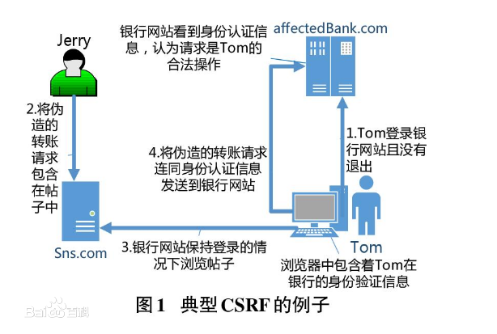

# 安全基础

## WEB 应用常见安全漏洞

### XSS - 跨站脚本攻击

#### 定义：

最普遍的 Web 应用安全漏洞。这类漏洞能够使得攻击者嵌入恶意脚本代码到正常用户会访问到的页面中，当正常用户访问该页面时，则可导致嵌入的恶意脚本代码的执行，从而达到恶意攻击用户的目的。

#### 例子：

提交的表单中，包含 JavaScript 语法等，提交后再渲染到页面上，导致其 HTML 标签与 JavaScript 被显示或者执行。

#### 影响：

- 盗用 cookie，获取敏感信息，以被攻击者的身份，进行一些操作；
- 页面渲染异常，数据异常；
- 访问量极大的一些页面上的 XSS 可以攻击一些小型网站，实现 DDoS 攻击的效果。

#### 防护措施：

- 使用 http only 的 cookie；
- 针对场景，对提交的数据进行严格校验，判断是否应该包含 HTML 标签，或者对内容进行转义。

### CSRF - 跨站请求伪造

#### 定义：

挟制用户在当前已登录的 Web 应用程序上执行非本意的操作的攻击方法。跟跨网站脚本（XSS）相比，XSS 利用的是用户对指定网站的信任，CSRF 利用的是网站对用户网页浏览器的信任。

#### 例子：



> 攻击者并不能通过 CSRF 攻击来直接获取用户的账户控制权，也不能直接窃取用户的任何信息。他们能做到的，是欺骗用户浏览器，让其以用户的名义运行操作。

#### 影响：

一旦发生，影响严重，丢失钱财。

#### 防护措施：

- 校验 referer 校验；
- 添加校验 token（或者别的自定义属性）放到 http 请求中。

### 点劫持攻击 - 界面伪装攻击

#### 定义：

攻击者使用一个或多个透明的 iframe 覆盖在一个正常的网页上，然后诱使用户在该网页上进行操作，当用户在不知情的情况下点击透明的 iframe 页面时，用户的操作已经被劫持到攻击者事先设计好的恶意按钮或链接上。攻击者既可以通过点击劫持设计一个独立的恶意网站，执行钓鱼攻击等；也可以与 XSS 和 CSRF 攻击相结合，突破传统的防御措施，提升漏洞的危害程度。

#### 例子：

恶意网站上用 iframe 嵌套了一个 微博关注某大 V 的页面，iframe 透明度设置为 0。页面上显示一些心动 💓 的图片，诱使用户点击，实际触发了微博页面的关注。

#### 影响：

- 类似 csrf

#### 防护措施：

X-FRAME-OPTIONS 是目前最可靠的方法。

X-FRAME-OPTIONS 是微软提出的一个 http 头，专门用来防御利用 iframe 嵌套的点击劫持攻击。

这个头有三个值：

```
DENY // 拒绝任何域加载
SAMEORIGIN // 允许同源域下加载
ALLOW-FROM // 可以定义允许frame加载的页面地址
```

## 代码安全

代码安全包含很多方面，一方面是各个中间件的使用不当，另一方面是业务逻辑上的漏洞，这里挑几个简单描述下。

### 越权

#### 例子：

- A 用户能看见或操作 B 用户的私密信息
- A 用户没有权限看见信息 B，但是权限没控制好，仍能看到
- A 用户没有订阅应用 B，但是仍能够访问

#### 防护措施：

- 提高安全意识，针对订单，交易等等信息，一定要考虑是否校验下单人。

### 重复提交

#### 例子：

员工点赞时，快速多次点击了提交，导致后台一次收到了多次相同的请求。如果没有做放重复提交的拦截，有可能导致同样的内容发放了多次，违背了用户的初衷。

#### 防护措施：

如果是服务端渲染的项目的话，跳转到点赞页面时，由服务端生成一个 token，放到页面上，提交时一起带到后段，由后端进行有效性校验（利用 redis 的分布式锁），保证一定的安全，防止重复提交。

### 信息安全

#### 例子（反例）：

- 用户修改密码时，密码直接明文传到后段；
- 页面渲染电子卡的卡密，或者调用接口获取卡密信息时明文传递；
- **卡密、工资等隐私信息直接在日志中打印；**
- 密码、工资等隐私信息，明文记录在数据库中；
- gfs 文件上传中，部分重要的文件使用 public 的方式上传；
- 部分 url 地址根据主键 ID 展示，又没有做校验，导致被用户根据自增 ID 查询所有数据；
- ......

#### 防护措施：

- 日志或者数据库中，明文记录隐秘信息，是十分危险的，针对密码等，请一定采用非对称加密，尽量保证无人能获取明文密码，针对卡密，工资等，采用对称加密，尽量保证密钥无人能获取完全，我们公司可考虑采用已有的 KMS。
- **日志安全**很重要，一般日志是不限制公司任何开发访问的，如果卡密、工资等信息记录在了日志中，相当于暴露在了所有人严重，所以针对重要的项目，一定要有这个意识，避免该问题。
- 虽然 https 基本保证了传输层的安全，但是考虑到中间人攻击漏洞、客户端中病毒、黄牛刷单（针对电子卡）等场景，建议针对比较重要的信息，还是采用一次对称加密后，再传到客户端/服务端。
- 部分文件，例如：账单、营业执照照片等等私密信息，使用 private 的方式上传，具体参考 [gfs - 使用指南](https://java.guide.wuxingdev.cn/java/gfs-sdk.html)。

### 代码编写不当

#### 例子：

- redis 模糊查询，一次查询大量的 key，导致 redis 堵塞，影响别的应用对 redis 的使用；
- mysql 批量查询，一次查询数据过大，或者搜索未走索引；
- mysql 使用 `${}` 进行排序，未对传入的参数进行校验，导致前端传入 sql，产生 sql 注入
- ......

#### 防护措施：

- redis 模糊查询尽量使用 scan 代替；
- 针对 mysql 的搜索，对数据的量要有个估计，如果估计数据会比较大，尽量使用分页，或者通过 es 来查询；
- 使用 `${}` 时，对传入的条件参数需要校验；
- ......

## 管理安全

这里针对我们公司目前的发布流程 - Frigate，其中体现了很多安全方面的考虑。

- 数据库权限按需分配，默认只分配 DDL；
- 执行的 sql 经过架构师审核后再上线，且只能通过 frigate 执行；
- 发布时，保证开发、测试、生产使用的产物是同一个，尽量避免上线的风险；
- ......
