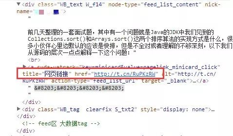
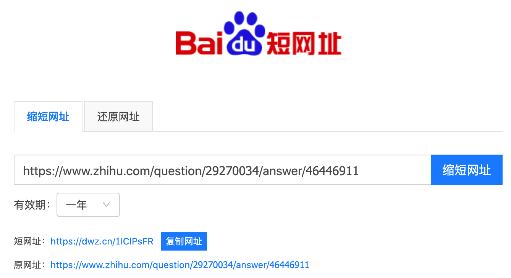
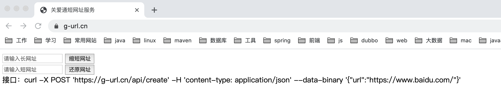

# 短链接（短网址）

## 一、前言

短网址：顾名思义，就是将长网址缩短到一个很短的网址，用户访问这个短网址可以重定向到原本的长网址（也就是还原的过程）。这样可以达到易于记忆、转换的目的，常用于有字数限制的微博、二维码等等场景。

关于短 URL 的使用场景，举个简单的例子来说明一下，看一下业务中使用短 URL 的重要性！

## 二、短地址使用场景

### 1、新浪微博

我们在新浪微博上发布网址的时候，微博会自动判别网址，并将其转换，例如：`https://t.cn/RuPKzRW`。为什么要这样做的？
这是因为微博限制字数为 140 字一条，那么如果我们需要发一些链接上去，但是这个链接非常的长，以至于将近要占用我们内容的一半篇幅，这肯定是不能被允许的或者说用户体验很差的，所以短网址应运而生了，短网址这种服务可以说是在微博出现之后才流行开来的！往下看：

**（1）首先，我先发一条微博带有一个 URL 地址：**

**（2）然后，看他转换之后显示的效果是什么样子的哪？**

**（3）查看对应页面元素的 HTML 源码如下：**

**（4）可以看出：**
`https://blog.csdn.net/xlgen157387/article/details/79863301` 被转换为：`http://t.cn/RuPKzRW`，此时你访问`http://t.cn/RuPKzRW`是可以定位到`https://blog.csdn.net/xlgen157387/article/details/79863301`，也就是实现了转换。

### 2、短网址二维码

网址在转换成短网址时，也可以生成相应的短网址二维码，短网址二维码的应用，二维码核心解决的是跨平台、跨现实的数据传输问题；而且二维码跟应用场景结合之后，所能解决的问题会越来越多。

（1）短网址二维码相比短链接更方便，能少输入，尽量少输入，哪怕只是少点一下键盘，都是有意义的。

（2）二维码只是扫描一个简单的链接，打开的却是一个世界。想象一下，用手机购买售货机里商品，二维码扫描是略快于从用手机找到该售货机并找到该商品的，而且这种操作相对于搜索/查找而言不是更优雅吗?

（3）所有商超里面的商品，都是使用条码来确定商品的唯一性的，去买单的时候都是扫描条码。试想，如果里面加入了更多产品的生产日期、厂家、流转途径、原材料等等信息，是不是厉害了呢?特别是针对食品信息的可追溯上，二维码应用场景更广泛。

## 三、短地址的好处

除了上述场景中，我们将长地址转换为短地址的使用场景的优点（压缩 URL 长度）之外，短地址还具有很多实际场景中的优点，例如：

（1）节省网址长度，便于社交化传播，一个是让 URL 更短小，传播更方便，尤其是 URL 中有中文和特殊字符，短网址解决很长的 URL 难以记忆不利于传播的问题；

（2）短网址在我们项目里可以很好的对开放以及对 URL 进行管理。有一部分网址可以会涵盖性、暴力、广告等信息，这样我们可以通过用户的举报，完全管理这个连接将不出现在我们的应用中，对同样的 URL 通过加密算法之后，得到的地址是一样的；

（3）方便后台跟踪点击量、地域分布等用户统计。我们可以对一系列的网址进行流量，点击等统计，挖掘出大多数用户的关注点，这样有利于我们对项目的后续工作更好的作出决策；

（4）规避关键词、域名屏蔽手段、隐藏真实地址，适合做付费推广链接；

（5）当你看到一个淘宝的宝贝连接后面是 200 个“e7x8bv7c8bisdj”这样的字符的时候，你还会觉得舒服吗。更何况微博字数只有 140 字，微博或短信里，字数不够，你用条短网址就能帮你腾出很多空间来；

## 四、短网址服务提供平台

目前，国内网又很多提供短地址服务的平台，例如：

- 新浪：http://sina.lt/
- 百度：http://dwz.cn/
- 0x3：http://0x3.me/
- MRW：http://mrw.so/

等等还有很多，这个可以搜索一下就会有很多！但是一个注意的是，如果使用某一个平台的短地址服务，一定要保证长期可靠的服务，不然一段时间失效了，我们以前已经转换的 URL 就完了！

这里以百度为例，如下所示：

## 五、关于如何生成短地址 URL 的讨论

关于短地址 URL 如何生成方式的，网上有很多方式，有基于映射的，有基于 Hash 的，有基于签名的，但是总的来说并不能满足绝大部分场景的使用，或者说是一种错误的设计方式。这里不再重复造轮子！以下是知乎用户 iammutex 关于该问题的探讨，截图过来和大家一起学习一下：

## 六、生成短地址 URL 需要注意的

看到上述知乎用户 iammutex 关于如何正确生成短地址 URL 的探讨，我们知道了，可以通过发号器的方式正确的生成短地址，生成算法设计要点如下：

（1）利用放号器，初始值为 0，对于每一个短链接生成请求，都递增放号器的值，再将此值转换为 62 进制（a-zA-Z0-9），比如第一次请求时放号器的值为 0，对应 62 进制为 a，第二次请求时放号器的值为 1，对应 62 进制为 b，第 10001 次请求时放号器的值为 10000，对应 62 进制为 sBc。

（2）将短链接服务器域名与放号器的 62 进制值进行字符串连接，即为短链接的 URL，比如：t.cn/sBc。

（3）重定向过程：生成短链接之后，需要存储短链接到长链接的映射关系，即 sBc -> URL，浏览器访问短链接服务器时，根据 URL Path 取到原始的链接，然后进行 302 重定向。映射关系可使用 K-V 存储，比如 Redis 或 Memcache。

## 七、生成短地址之后如何跳转呢？

对于该部分的讨论，我们可以认为他是整个交互的流程，具体的流程细节如下：

（1）用户访问短链接：http://t.cn/RuPKzRW；

（2）短链接服务器 t.cn 收到请求，根据 URL 路径 RuPKzRW 获取到原始的长链接（KV 缓存数据库中去查找）：https://blog.csdn.net/xlgen157387/article/details/79863301；

（3）服务器返回 302 状态码，将响应头中的 Location 设置为：https://blog.csdn.net/xlgen157387/article/details/79863301；

（4）浏览器重新向https://blog.csdn.net/xlgen157387/article/details/79863301发送请求；

（5）返回响应；

## 八、短地址发号器优化方案

### 1、算法优化

采用以上算法，如果不加判断，那么即使对于同一个原始 URL，每次生成的短链接也是不同的，这样就会浪费存储空间（因为需要存储多个短链接到同一个 URL 的映射），如果能将相同的 URL 映射成同一个短链接，这样就可以节省存储空间了。主要的思路有如下两个：

- 方案 1：查表

每次生成短链接时，先在映射表中查找是否已有原始 URL 的映射关系，如果有，则直接返回结果。很明显，这种方式效率很低。

- 方案 2：使用 LRU 本地缓存，空间换时间

使用固定大小的 LRU 缓存，存储最近 N 次的映射结果，这样，如果某一个链接生成的非常频繁，则可以在 LRU 缓存中找到结果直接返回，这是存储空间和性能方面的折中。

### 2、可伸缩和高可用

如果将短链接生成服务单机部署，缺点一是性能不足，不足以承受海量的并发访问，二是成为系统单点，如果这台机器宕机则整套服务不可 用，为了解决这个问题，可以将系统集群化，进行“分片”。

在以上描述的系统架构中，如果发号器用 Redis 实现，则 Redis 是系统的瓶颈与单点，因此，利用数据库分片的设计思想，可部署多个发号器实例，每个实例负责特定号段的发号，比如部署 10 台 Redis，每台分别负责号段尾号为 0-9 的发号，注意此时发号器的步长则应该设置为 10（实例个数）。

另外，也可将长链接与短链接映射关系的存储进行分片，由于没有一个中心化的存储位置，因此需要开发额外的服务，用于查找短链接对应的原始链接的存储节点，这样才能去正确的节点上找到映射关系。

## 九、GAT 短网址服务

[地址](https://g-url.cn/)

## 十、参考资料

[如何将一个长 URL 转换为一个短 URL？](https://mp.weixin.qq.com/s/o367qwLWSZTN8WGuf1OI7g)
