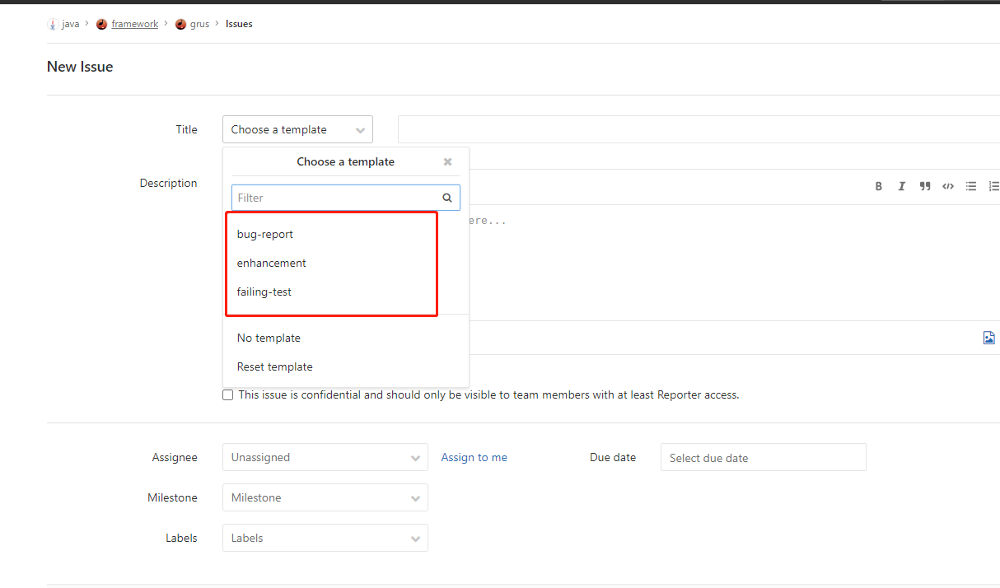
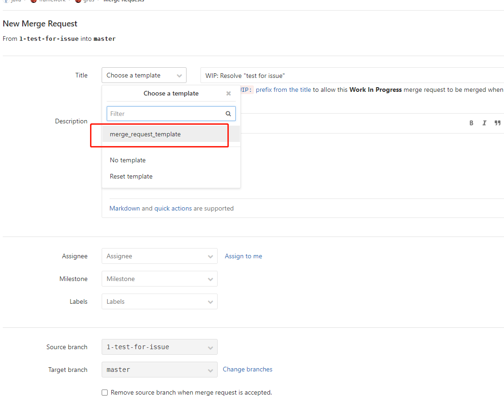

# Java 语言框架开发管理

## 工作职责

1. 解决一些通用的业务问题，比如分布式 id 生成器、比如支付 sdk 封装
2. 解决一些通用的技术问题，比如默认统一的 web 安全设置
3. 中间件 sdk 的封装：类似于 mysql 数据源连接组件
4. 一些架构的落地，比如微服务、高可用等等
5. 新技术的应用
6. 对开源软件依赖的升级与管理，如 jdk 版本、Spring Boot 版本
7. 把框架对应用的要求，反馈到 CI、CD 系统中
8. 提升开发团队的工程效率

## 工作要求

框架是技术管理里非常重要的一环，该团队应该能够做到以下几点：

- 鼓励每个开发研究、学习、贡献
- 框架封装，要体现一定的约束、自由度，自身要保持克制
- 一些新的重大功能，应该充分和别人讨论后实现、吸取他人建议
- 每次有新功能或者改变的时候，需要通知大家知晓。大的模块完成后，需要召开培训会议。

## 代码规范

- 需要符合代码规范
- 新代码确保单元测试 100%，bug 修复也需要加上单元测试
- 提交用户的邮箱请尽可能使用`gitlab`注册的邮箱

## 工作方式

首先需要明确：所有人均可以给框架贡献代码。所有人需要遵守以下流程：

1. 发起人提交 issue
2. 在由框架组审核通过后，发起人可以代码实现
3. 发起人在代码实现完成后，提交 Merge Request 给框架组审核
4. 审核通过后，即可以合并到 master
5. 提交 `说明文档` 到 [guide-java](https://gitlab.wuxingdev.cn/java/framework/guide-java) 和 [grus-wiki](https://gitlab.wuxingdev.cn/java/framework/grus/wikis/home)

## 提交 issue 流程

在提交 issue 时，必须选择模板：



有三个 label，分别的含义：

- bug-report：bug 报告
- enhancement：新特性
- failing-test：单元测试失败

加入选择`enhancement`：


其他几个 lable 都类似。

一个示范性的 issue： https://gitlab.wuxingdev.cn/java/framework/grus/issues/2

## 提交 MR 流程

> 待定，后续有可能修改

如果一个 MR，有关联的 issue，可以选择从 issue 创建。

提交 MR 也必须选择模板：




## 版本管理

版本号采用日历化版本(`YYYY.MINOR.MICRO`)，格式为年份.辅助版本号（次要版本号）.补丁版本号。

- YYYY：年份全称。e.g., 2020
- MINOR：辅助版本号，当年内从1 递增，发布一些特性或者优化
- MICRO：补丁版本号，当年内从 0 递增，不会增加新特性，只会做 bug-fix

> 例如，2021年的第一个版本为：2021.1，其第一个修复版本为2021.1.1。2021年的第二个版本为2021.2。

### 生命周期

- 每个次要版本，我们支持六个月的最长生命周期。如果应用依赖的 grus 版本超过六个月，那么 jenkins 构建就会失败。
- 对于 bug，我们会把补丁 backport 到受影响的所有生命周期内版本。也就是，对于超过生命周期的版本，不会有 bug 修复。

### 分支管理

我们采用主干开发的模式，master 为开发主线，次要版本拥有对应的分支。

- 所有新特性均在 feature 分支开发，合并到 master。
- 当前版本可以发布时，基于 master 分支创建 release 分支。当年的第一个版本则创建 2021.1.x 分支
- release 分支负责构建具体产物，2021.1.x 分支的第二个补丁版本构建的产物版本为 2021.1.2
- bug 修复也在 feature 分支开发，合并到所有受影响的 release 分支，是否合并 master 视情况而定。
- 所有版本都会有对应的 tag，2021 年开始，第一个发布是 2021.1，第一个补丁对应的 tag 是 2021.1.1.

## 提交说明

为了减少不必要的提交记录，开发时，统一由负责人cherry-pick相关的commit-id到master分支或者release分支。

release分支修复了bug后，统一由负责人merge（非fast-forward模式）到master分支和各相关的release分支，保留代码的合并记录，便于后续问题排查。git命令参考如下：

```shell
git merge --no-ff -e origin/2021.1.x
```

## 框架组

框架组是框架维护的核心人员，目前包括：

- 周智伟
- 万重阳
- 韦家驹
- 孙长浩
- 蔡磊

那么如何成为框架组成员呢？很简单，只要**最近半年贡献超过 6 个新特性或者 bug-fix**。
