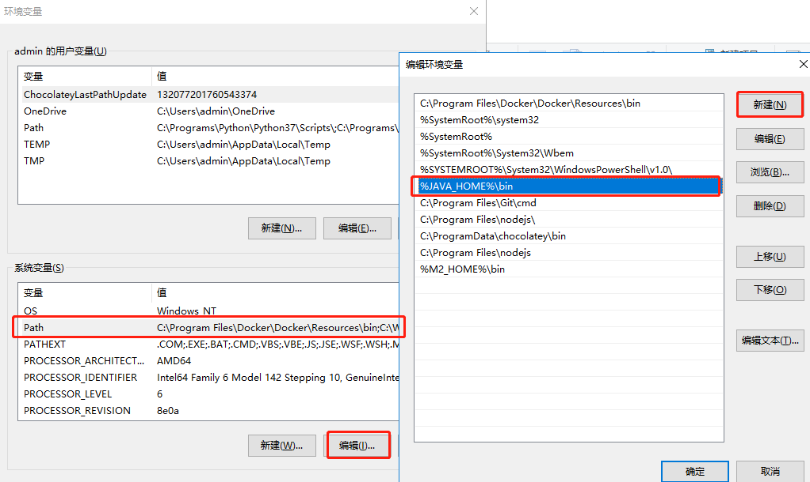
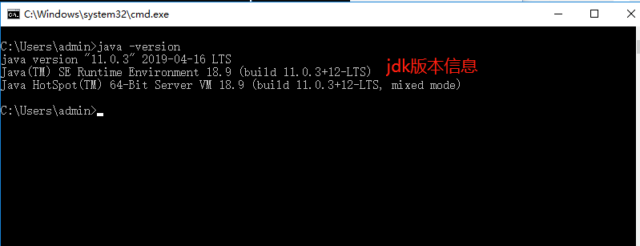

# Java 环境安装

公司目前使用 openjdk-11 进行开发，下载与配置流程如下：

## 下载地址

- 访问 [openjdk 下载地址](https://jdk.java.net/archive/) - 选择合适版本`openjdk`进行下载
- 访问 [oracle 下载地址](https://www.oracle.com/java/technologies/javase-downloads.html) - 选择合适的`jdk`进行下载

## 安装

### Windows

**第一步**

将下载的 zip 解压，放入到本地目录。

**第二步**

进入系统环境变量的设置页面，开始配置 jdk 的环境变量。


新建 `JAVA_HOME` 变量，并且输入 jdk-11 的安装目录。


编辑 `Path` 变量把 `%JAVA_HOME%\bin;` 这个变量插入。



通过 CMD，PowerShell 或者 Git Bash，输入 `java -version` 验证 jdk 安装是否成功。



### Mac

> 科普：卸载pkg安装的软件：[mac中如何卸载pkg](https://wincent.com/wiki/Uninstalling_packages_(.pkg_files)_on_Mac_OS_X)

**方案一**

终端设置环境变量， 不同 shell，配置的地址是不同的，下面用 zsh 举例：

假设压缩包最后是放在 Downloads 下。

```shell
# 命令行进入下载目录，解压下载的压缩包
tar -xf openjdk-11.0.2_osx-x64_bin.tar.gz
# 文件可以随意放目录，这里将 openjdk-11.0.2 放到 java 文件夹下
# 设置环境变量
# 根据 shell 使用的不同，设置的地址不同
# bash 一般是 ~/.bash_profile
# zsh 一般是 ~/.zshrc
# 没有对应文件的话，请自行创建
vi ~/.zshrc
# 修改文件，wq 保存并退出
export JAVA_HOME=/Users/Downloads/java/jdk-11.0.2/Contents/Home/bin
export PATH=$PATH:$JAVA_HOME
# 刷新生效
source ~/.zshrc
```

<Alert type="info">
  卸载，只要把文件和配置的环境变量删除即可
</Alert>

**方案二**

直接去oracle官网下载dmg安装包安装，下载地址为：[oracle 官网下载](https://www.oracle.com/java/technologies/javase-downloads.html)

**方案三**

使用 Homebrew 进行安装

```shell
brew search openjdk

brew install openjdk@11

# 卸载
brew uninstall openjdk@11
brew cleanup
```
