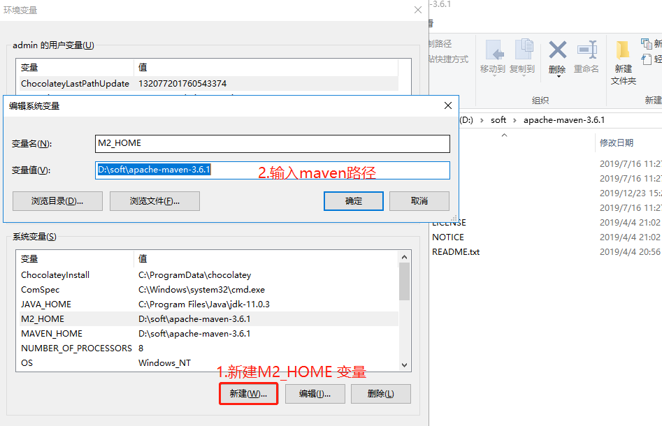

# Maven 安装

公司 JAVA 团队目前使用 maven 来管理项目，下载与环境配置如下：

> 也可以使用 IDEA 自带的 Maven，这样日常可以不用单独下载 maven 并配置环境变量，但仍需配置 setting.xml 文件。

## 下载地址

访问 [maven 官网下载地址](https://maven.apache.org/download.cgi) ，选择合适的版本下载，这里选择 3.6.3，实际版本可以根据实际情况变更。


## 安装

### windows

**第一步**

将下载的 zip 解压，放到本地目录。

**第二步**




```shell
# 验证是否安装成功
mvn -v
```

### mac

终端设置环境变量， 不同 shell，配置的地址是不同的，下面用 zsh 举例：

假设 maven 最后是放在 Downloads 下。

```shell
# 根据 shell 使用的不同，设置的地址不同
# bash 一般是 ~/.bash_profile
# zsh 一般是 ~/.zshrc
# 没有对应文件的话，请自行创建
vi ~/.zshrc
# 修改文件，wq 保存并退出
export M2_HOME=/Users/Downloads/maven/apache-maven-3.6.1/bin
export PATH=$PATH:$M2_HOME
# 刷新生效
source ~/.zshrc
```

<Alert type="info">
  卸载，只要把文件和配置的环境变量删除即可
</Alert>

## 配置公司的 setting.xml 文件

公司很多 jar（例如：巨灵神 API 等等）都是发布在公司自己搭建的 maven 仓库（仅内网可访问）中，如果想通过 maven 导入这些 jar，必须先修改本地 maven 的远程仓库地址，从默认的中央仓库改成公司自己的仓库，即替换 maven 目录下 conf 文件夹下的 setting.xml 文件。

公司 setting.xml 文件的下载地址：[setting.xml 下载，右击点击->链接另存为](../../assets/attach/settings.xml)
