# IntelliJ IDEA 使用技巧

!!! danger "禁止"

    关爱通 Java 开发全部使用 IDEA，禁止使用 Eclipse

[IDEA 官网下载](https://www.jetbrains.com/idea/download/)

## 版本选择

IDEA 有社区版和全功能版两个版本。社区版足够满足大家平常工作时，就是没有和 spring 集成相关的模板。用全功能版创建一个 spring boot 应用是非常方便快捷的。

版本号方便，当然是越新越好。

## 安装完后的常用设置

https://my.oschina.net/yuhuixin/blog/601426

大家最好把代码提示的首字母大小写敏感改为不敏感。

## 更改 Terminal 为 GitBash

对于 windows 用户来说，idea 使用的 Terminal 默认为 cmd，这个比较弱。可以按照以下流程更改：

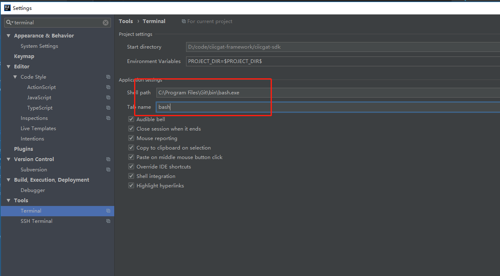

## 添加版权

**第一步：**

到 settings 的`Copyright Profiles`里添加关爱通版权信息，如下图

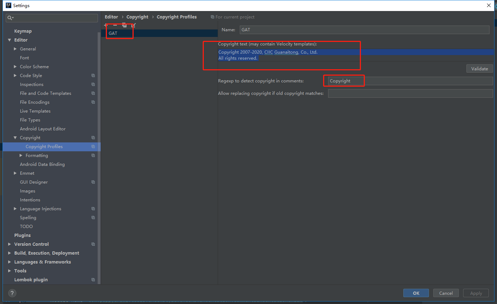

具体文字信息如下：

```
Copyright 2007-$today.year, CIIC Guanaitong, Co., Ltd.
All rights reserved.
```

**第二步：**

到`Copyright`里，把当前项目的版权设置为上一步添加的`GAT`，`Scope`为`Project Files`。如下图：

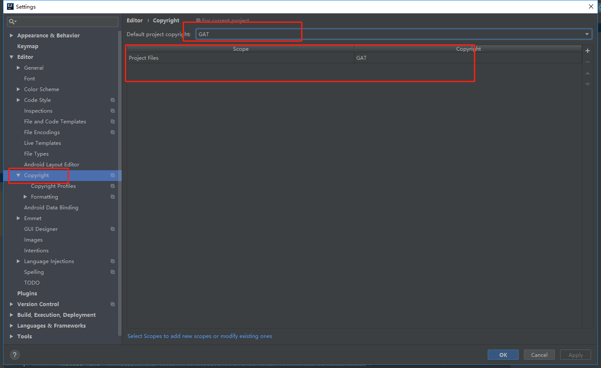

**第三步：**

右击项目，更新版权信息，如下图：

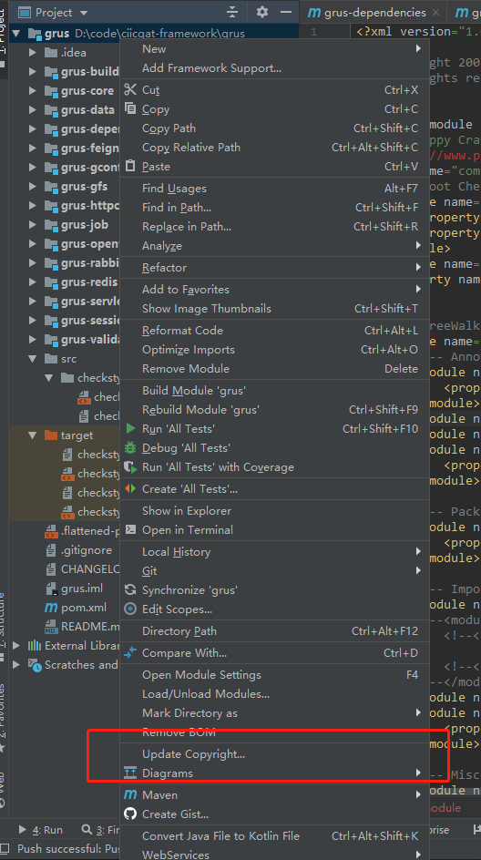

## 快捷键

IDEA 可以使用类 eclipse 的快捷键体系，但是推荐大家使用 IDEA 自身的快捷键体系，因为 idea 的功能远比 eclipse 的要丰富、强大。

1. `Ctrl+N`快速查找一个类， 功能类似与 eclipse 的`Ctrl+Shift+T`。默认查找的范围是你的项目里的代码，不包括 jdk 的类和引用 jar 的类。如果想包括，再按一次`Ctrl+N`即可，或者页面上用鼠标点击`Include non-project classes`即可。
2. `Ctrl+Shift+N`快速查找一个资源文件， 类似与 eclipse 的`Ctrl+Shift+R`
3. `Ctrl+Alt+L`代码格式化。功能类似与 eclipse 的`Ctrl+Shift+F`。
4. `Ctrl+F12`查看一个类的结构：所有成员变量和所有方法。功能类似与 eclipse 的`Ctrl+O`。
5. `Ctrl+Alt+O`自动导包。功能类似与 eclipse 的`Ctrl+Shift+O`。
6. `Ctrl+Shift+B`查看一个类的子类。功能类似与 eclipse 的`Ctrl+T`。
7. `Alt+F7`查看一个类、方法、变量等的使用的地方。功能类似与 eclipse 的`Ctrl+Shift+G`。
8. `Ctrl+e`打开最近使用的文件。
9. `Ctrl+f`文件内搜索。
10. `Ctrl+Shift+f`全局搜索。
11. `Ctrl+j`按照模板自动生成相应的代码块。如循环、main 函数、if 判断等等。。。
12. `Ctrl+alt+t`选择一块代码按这个快捷键，用循环、try catch、while、if 判断等 surround with 这段代码。
13. `Ctrl+f9`编译
14. `Ctrl+空白`代码自动提示。功能类似与 eclipse 的`Alt+/`。
15. `Ctrl+x`删除、剪切一行代码。功能类似与 eclipse 的`Ctrl+d`。
16. `Ctrl+d`复制一行代码。
17. `tab` tab 是根据模板简称自动生成一段代码。比如对于 mian 函数`public static void main`,只需要输入其 4 个单词的第一个字母`psvm`，再按`tab`，IDEA 就会给你生成完整的 main 函数。再比如`System.out.println()`,只需要输入简称`sout`，IDEA 就会自动生成`System.out.println()`。
18. `Ctrl+t`根据代码仓库更新整个项目。
19. `alt+enter`自动解决错误，比如缺少 import、类型错误等。
20. `alt+insert`生成代码，比如 getter、setter、contructor、equal、toString 等方法。
21. `Ctrl+Shift+u`大小写转换。

IDED 默认的 KeyMap:


## 代码提示

idea 代码提示功能非常强大。

1. 自动生成变量命名：


省去大家命名的苦恼。

2. 自动引入变量声明：
   
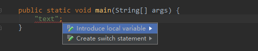

按`alt+enter`快捷键

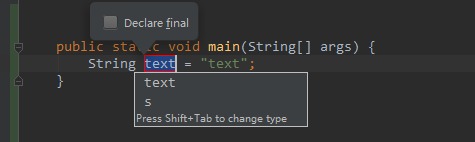

3.默认的，idea 所有的输入都会自动提示。可是当输入一半时，页面的焦点切换到其他地方，再切换回来时，自动提示就会消失。此时按`Ctrl+空白`代码又会重新出现。

## 其他实用的功能

1. 通过`run_with_coverage`运行单元测试，可以看到整体代码的覆盖率
   
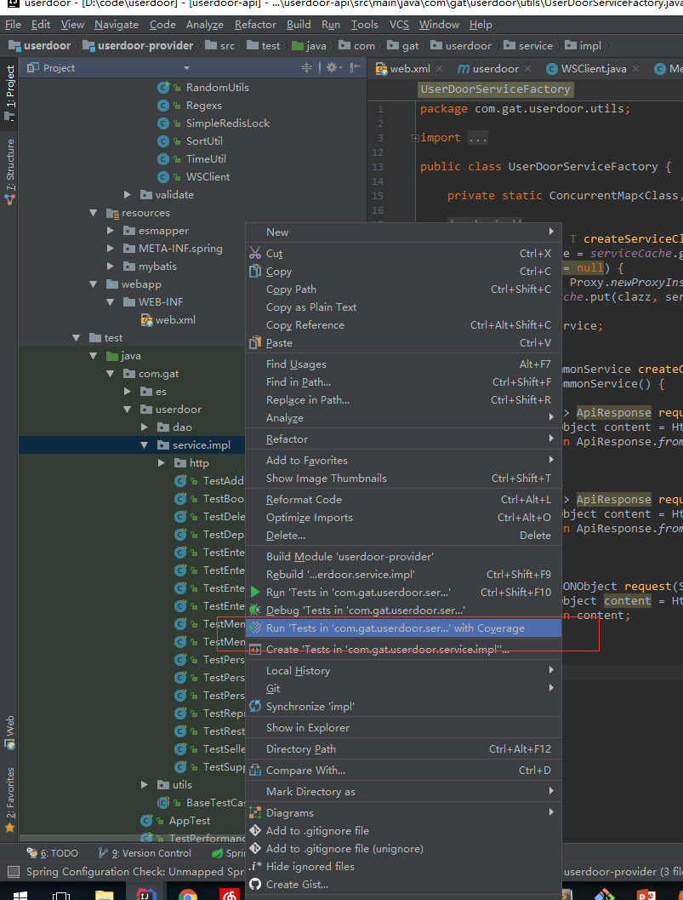
   
2. `Analyze->Inspect Code`初步分析代码质量。下面是 userdoor 的探测结果：

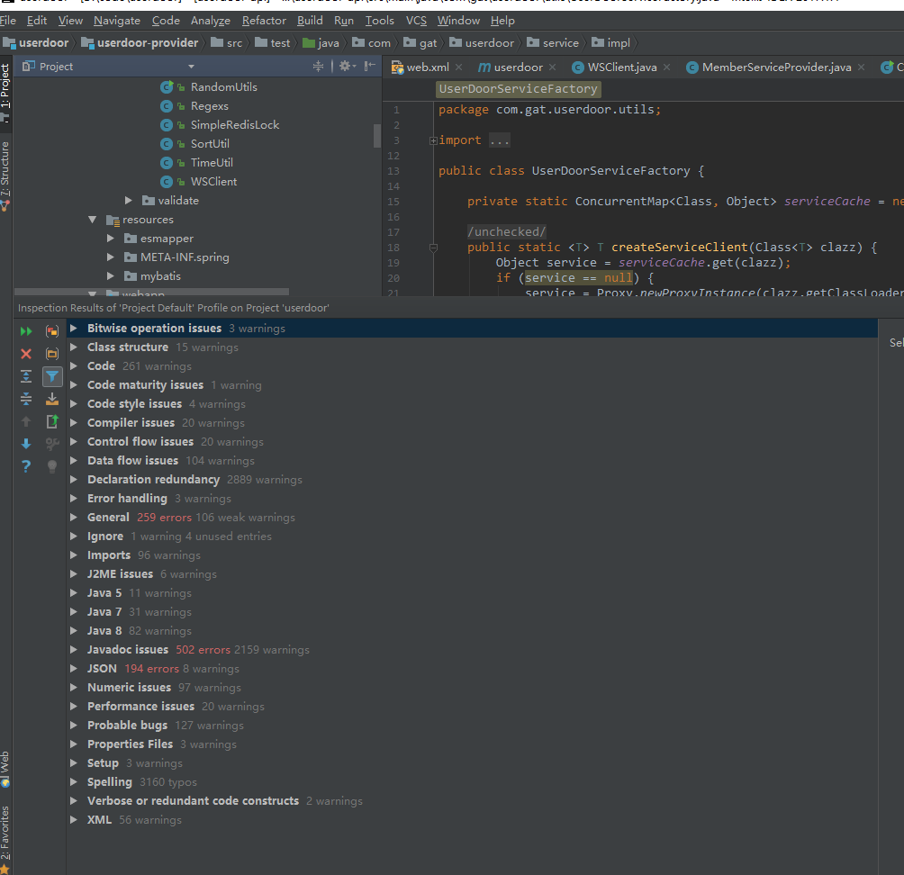

3. `Analyze->Code CleanUp`清理无用代码，包括无用的 import、无用的变量声明等。

## Lifecycle 插件

这里面需要注意的是，通过 maven 插件启动，需要把依赖的模块给 install 一下。因为 maven 是通过 jar 包管理依赖的，所以它不可能把依赖的模块的 class 目录等关联起来。

需要执行 maven 的命令，可以用 Lifecycle 菜单，如下图：


## 从数据库表生成 POJO

1. 在 IDEA 内新建 DataSource
   
  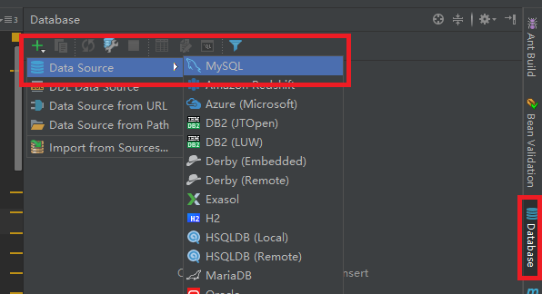

2. 填写 DataSource 的配置信息
   
  
   
  如果 driver 没有安装则先点击安装 driver

3. 替换生成代码的 groovy 文件，符号关爱通习惯
   
  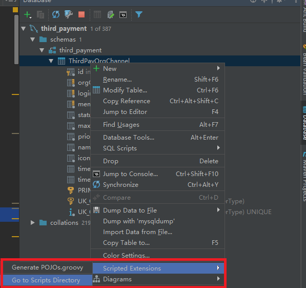

  脚本的下载地址为 https://gitlab.wuxingdev.cn/tech/guide-java/tree/master/images/skill/idea/pojo.groovy

4. 编辑 groovy 文件，替换为项目的包名
   
   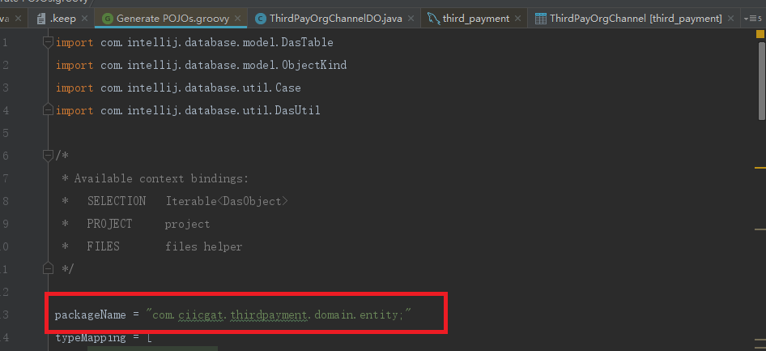
   
5. 选择目标文件夹生成 pojo
   
   
