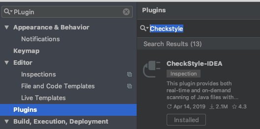
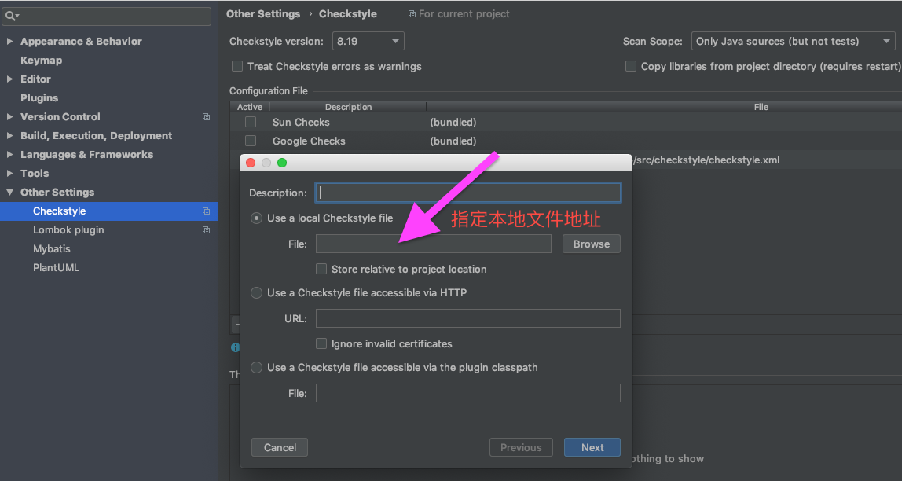

# Java 代码风格规范

> 一万个人心中有一万个哈姆雷特。

## 基本原則

1. 公共项目强制启用 api-checkstyle
2. 独立项目中前后保持一致原则

## API Checkstyle

针对中台服务封装的 client-sdk 类项目强制启用 api-checkstyle.xml。

涉及项目：

- ciicgat-api-fpp
- ciicgat-api-bpp
- ciicgat-api-app

### Checkstyle-IDEA

#### 安装

  

1. 安装 Checkstyle 插件,`Preference>Plugins>Marketplace` 输入 Checkstyle 关键字
2. 安装完成后重启 IDEA

#### 配置

  

1. 指定 checkstyle 文件路径，公共项目 src/checkstyle 目录下 `checkstyle.xml`
2. 点击下一步输入 checkstyle.header.file 文件地址 公共项目 src/checkstyle 目录下`checkstyle-header.txt`
3. 点击下一步，配置完成

  

#### 检查


### Maven 插件

#### 配置

```xml
<plugin>
    <groupId>org.apache.maven.plugins</groupId>
    <artifactId>maven-checkstyle-plugin</artifactId>
    <executions>
        <execution>
            <id>checkstyle-validation</id>
            <phase>validate</phase>
            <configuration>
                <configLocation>src/checkstyle/checkstyle.xml</configLocation>
                <headerLocation>src/checkstyle/checkstyle-header.txt</headerLocation>
                <encoding>UTF-8</encoding>
                <consoleOutput>true</consoleOutput>
                <failOnViolation>true</failOnViolation>
                <includeTestSourceDirectory>true</includeTestSourceDirectory>
            </configuration>
            <goals>
                <goal>check</goal>
            </goals>
        </execution>
    </executions>
</plugin>
```

#### 检验

项目根路径执行`mvn validate` ,控制台输出如下错误：

```shell
[INFO] 开始检查……
[ERROR] /Users/Albert/.repo/ciicgat/ciicgat-api-bpp/ciicgat-api-catalog/src/main/java/com/xyz/Sample.java:1: 当前行与被期待的 header: '^\Q/*\E$' 不符。 [RegexpHeader]
[ERROR] /Users/Albert/.repo/ciicgat/ciicgat-api-bpp/ciicgat-api-catalog/src/main/java/com/xyz/Sample.java:1:9: 名称 'com.xyz' 必须匹配表达式： '^com\.ciicgat\.api(\.[a-*)*$' 。 [PackageName]
[ERROR] /Users/Albert/.repo/ciicgat/ciicgat-api-bpp/ciicgat-api-catalog/src/main/java/com/ciicgat/api/catalog/model/EnterpriseBillDateSetting.java:1: 当前行与被期待的 h^\Q/*\E$' 不符。 [RegexpHeader]
检查完成。
```

## 其他项目

建议小团队范围内约定一种，基于 Checkstyle-IDEA 中内置的 Google 和 Sun 标准进行规范即可。

**同一个项目中代码规范保持一致，减轻心理负担**

## 最后

期待共同进步
