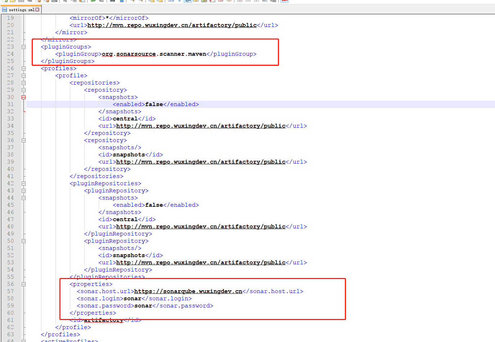
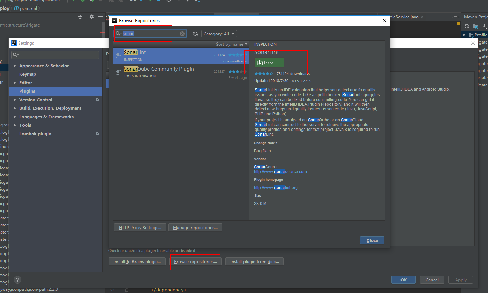
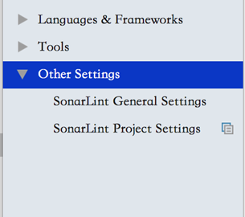
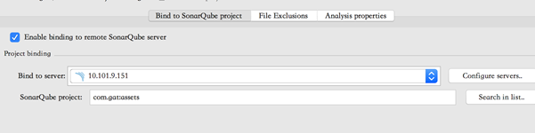
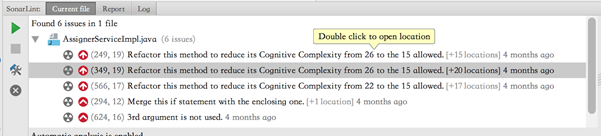

# SonarQube 本地配置指南

sonarqube 网址：https://sonarqube.wuxingdev.cn 可以使用 Gitlab 账号单点登陆。

因为 sonar 服务是 https 的（采用关爱通 CA 颁发），所以 jdk 里需要添加关爱通 CA 的信任，安装方法 [点击这里](https://guide.wuxingdev.cn/common/certificate-install.html#jdk%E8%AF%81%E4%B9%A6%E5%AF%BC%E5%85%A5)

修改本地`settings.xml`，如下图



文本在此：

```xml
<pluginGroups>
    <pluginGroup>org.sonarsource.scanner.maven</pluginGroup>
</pluginGroups>
```

```xml
<properties>
  <sonar.host.url>https://sonarqube.wuxingdev.cn</sonar.host.url>
  <sonar.login>sonar</sonar.login>
  <sonar.password>sonar</sonar.password>
</properties>
```

## JAVA 项目 pom 配置

pom 文件里需要添加 jacoco，用于统计单元测试覆盖率，如果不添加，那么覆盖率会显示 0%。

build 标签里添加:

```xml
<build>
  <plugins>
    <plugin>
      <groupId>org.jacoco</groupId>
      <artifactId>jacoco-maven-plugin</artifactId>
    </plugin>
  </plugins>
</build>
```

## 使用 sonarqube

进入到项目目录，命令行里直接使用命令:

```shell
mvn clean package sonar:sonar -U
```

打开 sonar 服务网站，即可看到你的项目的分析结果：


**目前使用的还是 sonar 官方默认的规则库，部分坏问题不一定需要修改，但是大部分还是有借鉴意义。**

## 在 Idea 中启用 Sonar

- 可以在 idea 的`settings->Plugins->Browse Repositories`搜索`sonar`，然后点击`Install`

  

- 如果网络不好，也可以使用本地插件安装。[访问IDEA官网下载插件](https://plugins.jetbrains.com/plugin/7973-sonarlint) ，点击`Install plugin from disk`，选择下载好的插件，安装。
- 重启 Idea 后，重新打开 Idea 的 Preference，可以看到`Other Settings`:

  

- 添加服务器https://sonarqube.wuxingdev.cn/

- SonarLint 项目设置:

  

- 这样就可以在 Idea 编辑器里看到 SonarLint 的提示了

  
