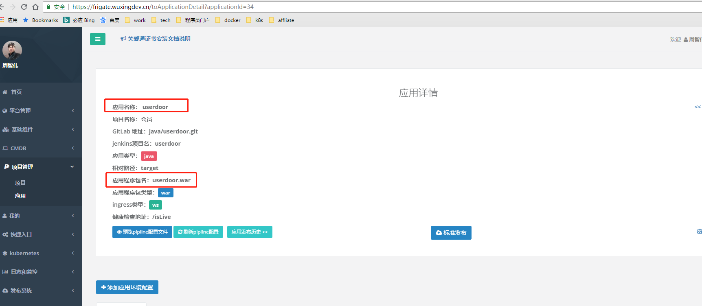

# maven 使用介绍

[setting.xml 下载，右击点击->链接另存为](../../assets/attach/settings.xml)

## Parent

因为我们 java 统一采用 grus 框架，所以你的项目的 parent，必须统一使用`grus-boot-starter-parent`，如下：

```xml
<parent>
    <groupId>com.ciicgat.grus.boot</groupId>
    <artifactId>grus-boot-starter-parent</artifactId>
    <version>${suggested-version}</version>
</parent>
```

此 parent 包含了 SpringBoot、Grus、Grus Boot、常用第三方、巨灵神 API 等的所有依赖。

<Alert type="warning">
  jar 包版本由 parent 统一定义，各自的项目不需要定义也禁止定义自己的版本。除非 parent 中不存在的，那么可以自己定义
</Alert>

如果你的项目需要发布到 maven 私服，那么你的 parent 必须继承`mvn-depoly-parent`：

如下：

```xml
<parent>
    <groupId>com.ciicgat</groupId>
    <artifactId>mvn-depoly-parent</artifactId>
    <version>1.0.0</version>
</parent>
```

## BOM

现代 java 的框架，基本都有物料清单。

基于 BOM，有以下优势：

1. 整合引用 JAR
2. 可以避免大量 GAV 罗列，大大减少了自有项目中 dependencyManagement 列表中的个数
3. 解决 jar 包版本冲突、不兼容问题
4. 减少重复代码、减少出错几率
5. 减少项目直属依赖，避免陷入依赖陷进
6. 开箱即用
7. 提高生产力
8. 便于架构层面做统一的封装和约束
9. 用的人很爽

## BuildName

项目必须要定义`finalName`标签值，这个值和你的应用名字相同。否则 Jenkins 编译后，无法发布到产物库之中。

如下:

```xml
<build>
  <finalName>userdoor</finalName> //这个finalName必须和下图红框中的名字相同
</build>
```



## 常用命令

因为我们关爱通的框架，都是通过 SNAPSHOT 版本引入的。所以经常存在需要跟新 snapshot 的需求，一般可以使用以下命令：

```shell
mvn package -U
```
